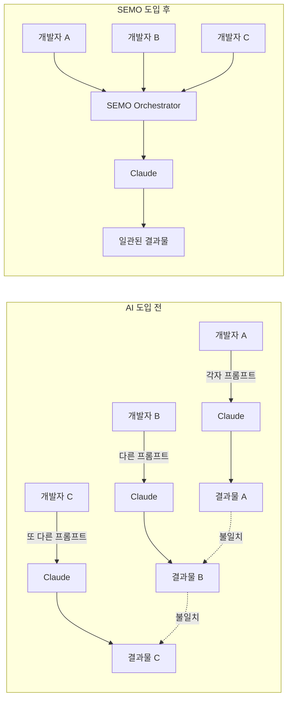

# 1편: AI가 코드를 짜는 시대, 우리는 무엇을 준비해야 하는가

> 시리즈: AI와 함께 일하는 법을 만들다 (1/7)

---

## 프롤로그: 2024년 1월의 어느 날

"이거 Claude한테 시키면 5분이면 되겠네."

세미콜론 팀의 개발자 A가 말했다. 신규 기능 개발 미팅에서였다. Claude Code가 출시된 지 몇 주 지나지 않았을 때다. 우리는 모두 흥분해 있었다. AI가 코드를 짜준다니!

그로부터 3개월 후, 우리는 다른 종류의 회의를 하고 있었다.

"A가 만든 코드랑 B가 만든 코드가 스타일이 완전히 다른데요."
"같은 요청인데 왜 결과가 다르죠?"
"AI가 우리 프로젝트 컨텍스트를 전혀 모르네요."

무엇이 잘못된 걸까?

---

## AI 코딩 도구의 빛과 그림자

### 빛: 개인 생산성의 폭발

AI 코딩 도구의 개인 생산성 향상은 의심의 여지가 없었다.

- 반복적인 보일러플레이트 코드? 10초면 생성.
- 복잡한 정규표현식? 설명만 하면 완성.
- 테스트 코드 작성? 기존 코드 보여주면 자동 생성.

우리 팀원들의 개인 생산성은 체감상 2-3배 향상되었다.

### 그림자: 팀 생산성의 혼란

하지만 **팀 단위**로 보면 이야기가 달랐다.

**문제 1: 프롬프트의 개인차**

```
개발자 A: "React로 버튼 컴포넌트 만들어줘"
→ 클래스 컴포넌트, CSS 파일 분리, PropTypes 사용

개발자 B: "React로 버튼 컴포넌트 만들어줘"
→ 함수형 컴포넌트, styled-components, TypeScript
```

같은 요청인데 결과가 완전히 다르다. AI는 사용자의 선호를 모르기 때문이다.

**문제 2: 프로젝트 컨텍스트 누락**

우리 프로젝트는 Next.js 14 App Router를 사용하고, Tailwind CSS를 쓰고, 특정 폴더 구조를 따른다. 하지만 AI는 이걸 모른다.

```
// AI가 생성한 코드
import styles from './Button.module.css';  // 우리는 Tailwind 쓰는데?

export default function Button() {
  return <button className={styles.button}>Click</button>
}
```

매번 "우리는 Tailwind 써", "App Router 구조로 해줘"라고 설명해야 했다.

**문제 3: 코드 리뷰의 지옥**

AI가 생성한 코드의 품질이 천차만별이었다.
- 어떤 건 베스트 프랙티스를 완벽히 따름
- 어떤 건 deprecated된 패턴 사용
- 어떤 건 보안 취약점 포함

코드 리뷰어는 "이게 AI가 짠 건지, 사람이 짠 건지" 구분할 수 없었고, 매번 처음부터 꼼꼼히 봐야 했다.

---

## 개인 도구 vs 팀 도구

여기서 우리는 핵심 깨달음을 얻었다.

> **AI 코딩 도구는 "개인 도구"로 설계되어 있다.**
>
> 하지만 우리에게 필요한 건 "팀 도구"다.

개인 도구와 팀 도구의 차이:

| 관점 | 개인 도구 | 팀 도구 |
|------|----------|---------|
| 컨텍스트 | 개인 선호 | 팀 규칙, 프로젝트 설정 |
| 일관성 | 필요 없음 | 필수 |
| 품질 관리 | 개인 책임 | 시스템이 보장 |
| 온보딩 | 각자 알아서 | 표준화된 프로세스 |

---

## SAX의 탄생: "AI에게 우리 팀의 규칙을 가르치자"

2024년 3월, 우리는 결심했다.

**"AI를 팀에 맞게 커스터마이징하자."**

아이디어는 단순했다:
1. 팀의 코딩 규칙을 문서화한다
2. 프로젝트 컨텍스트를 정리한다
3. AI에게 매번 이 정보를 전달한다

이걸 자동화하면 되지 않을까?

```
사용자 요청
    ↓
[팀 규칙 + 프로젝트 컨텍스트 주입]
    ↓
AI 처리
    ↓
일관된 결과물
```

이 아이디어가 **SAX (Semicolon AI Transformation)**의 시작이었다.

---

## 첫 번째 의사결정: 프레임워크를 만들자

### Why: 왜 프레임워크가 필요한가?

단순히 프롬프트 템플릿을 공유하는 것으로는 부족했다. 이유:

1. **프롬프트는 쉽게 무시된다**: "나는 내 방식이 더 좋아"
2. **버전 관리가 어렵다**: 누가 최신 프롬프트를 쓰는지 모름
3. **강제성이 없다**: 규칙을 어겨도 티가 안 남

우리에게 필요한 건:
- **강제성**: 모든 AI 요청이 특정 경로를 통과
- **투명성**: AI가 무엇을 했는지 명확히 표시
- **확장성**: 새로운 규칙을 쉽게 추가

### Decision: CLAUDE.md 기반 프레임워크

Claude Code의 `CLAUDE.md` 파일에 주목했다. 이 파일은 Claude가 프로젝트를 이해하는 데 사용하는 컨텍스트다.

```markdown
# 우리 팀의 CLAUDE.md

## 코딩 규칙
- TypeScript 필수
- Tailwind CSS 사용
- 함수형 컴포넌트만 사용

## 프로젝트 구조
- /app: Next.js App Router 페이지
- /components: 재사용 컴포넌트
- /lib: 유틸리티 함수

## 금지 사항
- CSS-in-JS 사용 금지
- any 타입 사용 금지
```

이 파일을 잘 구조화하면, 모든 AI 요청에 팀 규칙이 자동으로 적용된다!

---

## Try it yourself: 30초 만에 SEMO 설치하기

지금 바로 SEMO를 체험해 볼 수 있다.

```bash
# 1. SEMO CLI 설치 및 초기화
npx @team-semicolon/semo-cli init

# 2. 생성된 파일 확인
ls -la .claude/
# CLAUDE.md       - AI 규칙 설정
# settings.json   - MCP 서버 설정
# memory/         - 컨텍스트 저장소
```

설치 후 Claude Code를 재시작하면, 모든 요청에 SEMO가 적용된다.

```markdown
# 테스트해보기
사용자: "버튼 컴포넌트 만들어줘"

# SEMO가 적용된 응답
[SEMO] Orchestrator: 의도 분석 완료 → 코드 구현 요청
[SEMO] Skill 위임: semo-skills/coder/implement
[SEMO] 플랫폼 자동 감지: Next.js (next.config.js 발견)

## 버튼 컴포넌트를 생성합니다.
...
```

모든 AI 응답에 `[SEMO]` 태그가 붙어서, AI가 무엇을 했는지 투명하게 보인다.

---

## 다음 편 예고

이렇게 시작된 SAX 프로젝트. 하지만 "프론트엔드 개발자용", "백엔드 개발자용"으로 역할별 패키지를 나누면서 복잡해지기 시작했다.

**2편: SAX의 탄생 - 역할 기반 AI 에이전트 시스템을 설계하다**에서 계속됩니다.

---



---

*다음 편: [역할 기반 AI 에이전트 시스템을 설계하다](./02-sax-birth.md)*
