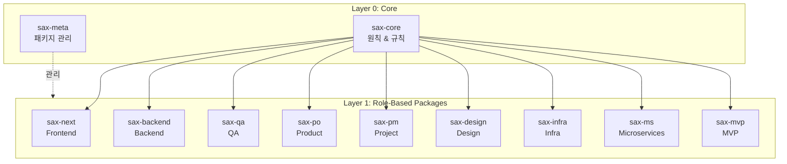

# 2편: SAX의 탄생 - 역할 기반 AI 에이전트 시스템을 설계하다

> 시리즈: AI와 함께 일하는 법을 만들다 (2/7)

---

## 프롤로그: "각자 다른 AI가 필요해"

2024년 4월, SAX 프로젝트 킥오프 미팅.

"프론트엔드 개발자가 필요한 AI 지식과 백엔드 개발자가 필요한 건 달라요."
"QA 담당자는 테스트 작성에 특화된 AI가 필요하고요."
"PO는 기획 문서 작성을 도와주는 AI가 필요해요."

우리 팀에는 다양한 역할이 있었다. 프론트엔드, 백엔드, QA, PO, PM, 인프라... 각 역할마다 AI에게 원하는 게 달랐다.

그래서 우리는 결정했다.

> **"역할별로 전문화된 AI 에이전트를 만들자."**

---

## SAX의 4대 원칙

프레임워크를 설계하기 전에, 우리는 핵심 원칙을 정했다.

### 1. Transparency (투명성)

> 모든 AI 작업은 명시적으로 표시되어야 한다.

```markdown
[SAX] Orchestrator: 의도 분석 완료 → 프론트엔드 구현 요청
[SAX] Agent: sax-next/coder 호출
[SAX] Skill: implement 실행 중
```

AI가 뭘 하고 있는지 항상 보여야 한다. "마법의 블랙박스"는 안 된다.

**Why?**
- 디버깅이 가능해진다
- 사용자가 AI의 판단을 검증할 수 있다
- 팀원 간 커뮤니케이션이 쉬워진다 ("sax-next가 처리한 코드야")

### 2. Consistency (일관성)

> 통일된 메시지 포맷과 응답 구조를 유지한다.

모든 SAX 패키지는 같은 형식으로 응답한다:

```markdown
[SAX] {Component}: {Action}

## {Title}
{Content}

### 다음 단계
- [ ] {Task 1}
- [ ] {Task 2}
```

**Why?**
- 예측 가능한 UX
- 파싱/자동화 가능
- 학습 곡선 최소화

### 3. Modularity (모듈성)

> 각 패키지는 독립적으로 동작할 수 있어야 한다.

sax-next만 설치해도 동작해야 하고, sax-backend만 설치해도 동작해야 한다.

```bash
# 프론트엔드만 필요하면
git submodule add sax-next

# 백엔드도 필요하면
git submodule add sax-backend
```

**Why?**
- 필요한 것만 설치 가능
- 패키지별 독립 배포
- 복잡성 관리

### 4. Hierarchy (계층성)

> Core → Skills → Extensions 순으로 상속한다.

```
sax-core (공통 원칙, 기본 규칙)
    ↓
sax-next (프론트엔드 특화 스킬)
    ↓
프로젝트별 확장 (우리 프로젝트 규칙)
```

**Why?**
- 중복 최소화
- 규칙의 계층적 오버라이드
- 유지보수 용이

---

## 11개 패키지 구조

이 원칙을 바탕으로, 우리는 11개의 패키지를 만들었다.

### Layer 0: Core

| 패키지 | 역할 |
|--------|------|
| **sax-core** | 공통 원칙, Orchestrator, 기본 스킬 |
| **sax-meta** | SAX 패키지 자체 관리, 메타 작업 |

### Layer 1: Role-Based Packages

| 패키지 | 대상 역할 | 주요 스킬 |
|--------|----------|----------|
| **sax-next** | 프론트엔드 (Next.js) | 컴포넌트 생성, 페이지 라우팅 |
| **sax-backend** | 백엔드 (Spring) | API 설계, DB 모델링 |
| **sax-qa** | QA | 테스트 작성, 버그 분석 |
| **sax-po** | Product Owner | 요구사항 정의, 스펙 작성 |
| **sax-pm** | Project Manager | 일정 관리, 리스크 분석 |
| **sax-design** | Designer | UI 스펙, 디자인 시스템 |
| **sax-infra** | 인프라 | Docker, K8s, CI/CD |
| **sax-ms** | MSA 아키텍트 | 서비스 분리, 통신 설계 |
| **sax-mvp** | MVP 개발 | 빠른 프로토타이핑 |



---

## Orchestrator-First 정책

11개 패키지가 있으면, AI가 어떤 패키지를 써야 할지 어떻게 알까?

여기서 **Orchestrator**가 등장한다.

### Orchestrator란?

사용자 요청을 분석하고, 적절한 에이전트/스킬로 라우팅하는 "교통경찰" 역할.

```
사용자: "로그인 폼 만들어줘"
    ↓
[Orchestrator] 의도 분석
    - 카테고리: 코드 구현
    - 대상: 프론트엔드 UI
    - 기술: React 컴포넌트
    ↓
[Orchestrator] 라우팅 결정
    → sax-next/coder 호출
    ↓
[sax-next] 구현 실행
```

### Orchestrator-First 정책

> **모든 요청은 Orchestrator를 먼저 거쳐야 한다.**

이게 왜 중요할까?

**Before (Orchestrator 없음)**
```
사용자: "로그인 폼 만들어줘"
AI: (어떤 컨텍스트도 없이) 일반적인 React 코드 생성
결과: 프로젝트 규칙 무시, 스타일 불일치
```

**After (Orchestrator-First)**
```
사용자: "로그인 폼 만들어줘"
Orchestrator: 의도 분석 → 프론트엔드 구현 요청
Orchestrator: sax-next/coder 호출 (플랫폼: Next.js)
sax-next: 프로젝트 규칙 적용하여 코드 생성
결과: 일관된 코드, 팀 규칙 준수
```

---

## Git Submodule 기반 설치

패키지 배포 방식도 고민이었다. npm? 모노레포?

우리는 **Git Submodule**을 선택했다.

### 설치 방법

```bash
# 1. .claude 디렉토리 생성
mkdir -p .claude

# 2. sax-core 설치 (필수)
git submodule add https://github.com/semicolon-devteam/sax-core .claude/sax-core

# 3. 필요한 패키지 추가
git submodule add https://github.com/semicolon-devteam/sax-next .claude/sax-next
git submodule add https://github.com/semicolon-devteam/sax-backend .claude/sax-backend
```

### 왜 Git Submodule?

| 선택지 | 장점 | 단점 |
|--------|------|------|
| npm | 익숙함, 버전 관리 쉬움 | Claude Code가 인식 안 함 |
| 모노레포 | 한 번에 관리 | 필요 없는 것도 설치됨 |
| **Git Submodule** | 필요한 것만 설치, Claude 인식 | 업데이트가 번거로움 |

Claude Code는 `.claude/` 디렉토리의 파일을 자동으로 읽는다. Git Submodule로 이 디렉토리에 패키지를 넣으면, 별도 설정 없이 바로 동작한다.

---

## 실제 사용 예시

### 프론트엔드 컴포넌트 생성

```markdown
사용자: 버튼 컴포넌트 만들어줘

[SAX] Orchestrator: 의도 분석 완료 → 프론트엔드 구현 요청
[SAX] Agent: sax-next/coder 호출

## 버튼 컴포넌트를 생성합니다.

### 파일 구조
- components/ui/Button.tsx
- components/ui/Button.test.tsx

### 코드

```tsx
// components/ui/Button.tsx
interface ButtonProps {
  variant?: 'primary' | 'secondary' | 'outline';
  size?: 'sm' | 'md' | 'lg';
  children: React.ReactNode;
  onClick?: () => void;
}

export function Button({
  variant = 'primary',
  size = 'md',
  children,
  onClick
}: ButtonProps) {
  const baseStyles = "rounded-lg font-medium transition-colors";
  const variants = {
    primary: "bg-blue-500 text-white hover:bg-blue-600",
    secondary: "bg-gray-200 text-gray-800 hover:bg-gray-300",
    outline: "border border-gray-300 hover:bg-gray-50"
  };
  const sizes = {
    sm: "px-3 py-1.5 text-sm",
    md: "px-4 py-2 text-base",
    lg: "px-6 py-3 text-lg"
  };

  return (
    <button
      className={`${baseStyles} ${variants[variant]} ${sizes[size]}`}
      onClick={onClick}
    >
      {children}
    </button>
  );
}
```

### 다음 단계
- [ ] Storybook 스토리 추가
- [ ] 접근성 테스트
```

보이는가? AI가 우리 프로젝트의 규칙(Tailwind, TypeScript, 함수형 컴포넌트)을 자동으로 따르고 있다.

---

## Try it yourself: Orchestrator-First 정책 이해하기

SEMO가 설치된 프로젝트에서 아무 요청이나 보내보자.

```markdown
# 사용자 요청을 보내면...

## 1. Orchestrator가 먼저 분석
[SEMO] Orchestrator: 의도 분석 완료 → 코드 구현 요청

## 2. 적절한 Skill로 라우팅
[SEMO] Skill 위임: semo-skills/coder/implement (platform: nextjs)

## 3. Skill이 실행
[SEMO] Skill: implement 사용

## 이 모든 과정이 투명하게 표시됩니다!
```

`[SEMO]` 태그로 시작하는 줄을 보면, AI가 어떤 판단을 내렸는지 알 수 있다.

---

## 의사결정 포인트

### Why: 역할별로 다른 컨텍스트가 필요

- 프론트엔드 개발자는 React, CSS, 접근성에 대해 알아야 한다
- 백엔드 개발자는 Spring, DB, API 설계에 대해 알아야 한다
- 이 지식을 하나의 AI에 다 넣으면 컨텍스트가 너무 커진다

### Decision: Multi-repo, 역할 기반 패키지 분리

- 11개의 독립된 Git 레포지토리
- 각각 전문화된 CLAUDE.md
- Git Submodule로 필요한 것만 설치

### Trade-off: 유연성 vs 복잡성

**얻은 것**
- 필요한 패키지만 설치 가능
- 패키지별 독립 배포
- 역할에 맞는 최적화된 응답

**잃은 것**
- 설치 복잡성 증가
- 패키지 간 동기화 필요
- 업데이트 번거로움

이 trade-off가 나중에 문제가 될 줄은... 다음 편에서!

---

## 다음 편 예고

11개 패키지, 각각 150~200줄의 CLAUDE.md... 총 1,800줄의 중복 코드가 발생했다. 그리고 각 패키지가 서로의 존재를 모르는 "사일로 현상"도 심해졌다.

**3편: 토큰 지옥과 컨텍스트 파편화**에서 계속됩니다.

---

*이전 편: [AI가 코드를 짜는 시대](./01-beginning.md)*
*다음 편: [토큰 지옥과 컨텍스트 파편화](./03-token-crisis.md)*
