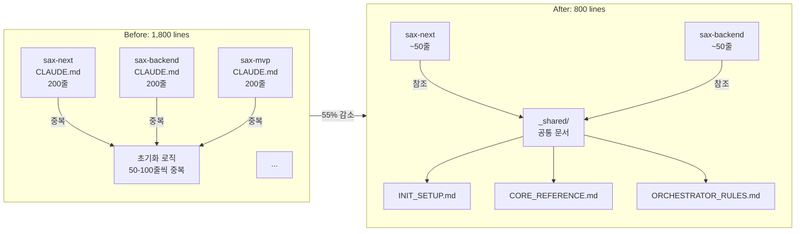

# 3편: 첫 번째 위기 - 토큰 지옥과 컨텍스트 파편화

> 시리즈: AI와 함께 일하는 법을 만들다 (3/7)

---

## 프롤로그: "왜 이렇게 느려졌지?"

2024년 6월, SAX v0.23.0이 안정화될 무렵.

"요즘 Claude 응답이 느려진 것 같아요."
"컨텍스트 윈도우 초과했다는 경고가 자주 떠요."
"같은 프로젝트에서 sax-next랑 sax-backend를 같이 쓰면 이상해져요."

무언가 잘못되고 있었다.

우리는 각 패키지의 CLAUDE.md 파일을 열어봤다. 그리고 깨달았다.

> **1,800줄. 11개 패키지의 CLAUDE.md 총합이 1,800줄이었다.**

---

## 문제 발견: 중복의 늪

### 문제 1: 초기화 로직의 중복

모든 패키지가 비슷한 초기화 설정을 가지고 있었다.

```markdown
# sax-next/CLAUDE.md (200줄)

## 기본 설정
이 파일은 sax-next 패키지의 설정입니다...
[50줄의 공통 설명]

## Orchestrator 규칙
모든 요청은 Orchestrator를 거쳐야 합니다...
[30줄의 공통 규칙]

## 메시지 포맷
[SAX] 태그로 시작해야 합니다...
[20줄의 공통 포맷]

## 프론트엔드 특화 내용
[100줄의 실제 내용]
```

```markdown
# sax-backend/CLAUDE.md (200줄)

## 기본 설정
이 파일은 sax-backend 패키지의 설정입니다...
[50줄의 공통 설명 - sax-next와 거의 동일]

## Orchestrator 규칙
모든 요청은 Orchestrator를 거쳐야 합니다...
[30줄의 공통 규칙 - 완전 동일]

## 메시지 포맷
[SAX] 태그로 시작해야 합니다...
[20줄의 공통 포맷 - 완전 동일]

## 백엔드 특화 내용
[100줄의 실제 내용]
```

11개 패키지 × 100줄 중복 = **1,100줄의 낭비**.

### 문제 2: 토큰 비용의 폭발

LLM에게 컨텍스트를 전달할 때마다 토큰이 소비된다.

```
Claude의 컨텍스트 윈도우: ~100,000 토큰
SAX 패키지 로딩: ~5,000~10,000 토큰
사용자의 실제 대화: ~10,000 토큰

남은 여유: 80,000 토큰
```

얼핏 보면 여유가 있어 보이지만...

- 파일 읽기/쓰기마다 토큰 추가 소비
- 히스토리가 쌓이면 기하급수적 증가
- 복잡한 작업에서 컨텍스트 초과 발생

### 문제 3: 사일로(Silo) 현상

각 패키지가 서로의 존재를 몰랐다.

```markdown
# sax-next 입장에서
"나는 프론트엔드 전문가야"
"백엔드? 그게 뭔데?"

# sax-backend 입장에서
"나는 백엔드 전문가야"
"프론트엔드? 그게 뭔데?"
```

풀스택 작업이 필요하면?

```
사용자: "로그인 기능 전체를 구현해줘"

AI (sax-next): "프론트엔드 로그인 폼 만들었습니다"
AI (sax-backend): "백엔드 인증 API 만들었습니다"

결과: 서로 연결이 안 됨
```

---

## 토큰 경제학의 깨달음

여기서 우리는 중요한 깨달음을 얻었다.

> **AI 프레임워크에서 토큰은 "화폐"다.**
>
> 낭비하면 파산한다.

### 토큰 = 비용 + 속도 + 품질

| 토큰 사용량 | 비용 | 속도 | 품질 |
|------------|------|------|------|
| 적음 | 저렴 | 빠름 | 컨텍스트 부족 |
| **적정** | **적정** | **적정** | **최적** |
| 많음 | 비쌈 | 느림 | 컨텍스트 혼란 |

토큰을 "적정"하게 사용하는 것이 핵심이다.

---

## 해결책: v0.27.0 토큰 최적화

### 접근법: 공유 문서 + 참조

아이디어는 간단했다:

1. 공통 내용을 별도 파일로 분리
2. 각 패키지는 "참조"만 유지
3. 필요할 때만 상세 내용 로드

### 구조 변경

**Before**
```
sax-core/CLAUDE.md (200줄)
sax-next/CLAUDE.md (200줄, 50% 중복)
sax-backend/CLAUDE.md (200줄, 50% 중복)
...
총 1,800줄
```

**After**
```
_shared/
├── INIT_SETUP.md (50줄, 공통 초기화)
├── SAX_CORE_REFERENCE.md (30줄, 원칙 참조)
└── ORCHESTRATOR_RULES.md (30줄, 라우팅 규칙)

sax-core/CLAUDE.md (100줄, _shared 참조)
sax-next/CLAUDE.md (50줄, 핵심만)
sax-backend/CLAUDE.md (50줄, 핵심만)
...
총 800줄
```



### 결과: 55% 토큰 감소

| 지표 | Before | After | 개선 |
|------|--------|-------|------|
| 총 CLAUDE.md 줄 수 | 1,800 | 800 | -55% |
| 평균 응답 시간 | 3.2초 | 1.8초 | -44% |
| 컨텍스트 초과 빈도 | 주 5회 | 주 1회 | -80% |

---

## Progressive Disclosure 패턴

토큰 최적화의 핵심은 **Progressive Disclosure**(점진적 공개)다.

### 원칙: 필요할 때만 로드

```markdown
# CLAUDE.md (최소 컨텍스트)

## 핵심 원칙
- 모든 요청은 Orchestrator를 거친다
- [SAX] 태그로 시작한다

## 상세 정보
상세 정보가 필요하면 다음 파일을 참조:
- 스킬 목록: @_shared/SKILLS.md
- 코딩 규칙: @_shared/CODING_RULES.md
- 테스트 규칙: @_shared/TESTING_RULES.md
```

AI는 기본 컨텍스트만 로드하고, 특정 작업이 필요할 때 관련 파일을 추가로 읽는다.

### 구현 예시

```markdown
# 사용자 요청: "테스트 코드 작성해줘"

[SAX] Orchestrator: 테스트 작성 요청 감지
[SAX] 추가 컨텍스트 로드: @_shared/TESTING_RULES.md
[SAX] Agent: sax-qa/tester 호출

## 테스트 코드를 작성합니다.
(TESTING_RULES.md의 규칙이 적용됨)
```

---

## 사일로 문제 해결: 크로스 패키지 인식

토큰 최적화와 함께, 사일로 문제도 해결해야 했다.

### 접근법: 패키지 맵

```markdown
# _shared/PACKAGE_MAP.md

## 설치된 패키지
현재 프로젝트에 설치된 SAX 패키지:
- sax-core (필수)
- sax-next (프론트엔드)
- sax-backend (백엔드)

## 협업 규칙
풀스택 작업 시:
1. sax-core가 전체 계획 수립
2. sax-next가 프론트엔드 구현
3. sax-backend가 백엔드 구현
4. 인터페이스 명세로 연결점 정의
```

### 풀스택 작업 예시

```markdown
사용자: "로그인 기능 전체를 구현해줘"

[SAX] Orchestrator: 풀스택 작업 감지
[SAX] 패키지 맵 참조: sax-next + sax-backend 설치됨
[SAX] 계획 수립:
    1. API 인터페이스 정의 (공통)
    2. 백엔드 인증 API 구현 (sax-backend)
    3. 프론트엔드 로그인 폼 구현 (sax-next)

## 1. API 인터페이스 정의

### POST /api/auth/login
Request:
{
  "email": "string",
  "password": "string"
}

Response:
{
  "token": "string",
  "user": { "id": "string", "name": "string" }
}

## 2. 백엔드 구현
[SAX] Agent: sax-backend/coder
(인터페이스에 맞춰 구현)

## 3. 프론트엔드 구현
[SAX] Agent: sax-next/coder
(인터페이스에 맞춰 구현)

## 연결 완료
프론트엔드 → API → 백엔드가 정상 연결됩니다.
```

---

## 의사결정 포인트

### Why: LLM에게 매번 같은 설명을 반복하는 건 비효율

- 토큰은 비용이다
- 중복 컨텍스트는 AI를 혼란시킨다
- 응답 속도가 느려진다

### Decision: 공유 문서 + 참조 방식으로 전환

- `_shared/` 디렉토리에 공통 문서 집중
- 각 패키지는 최소 컨텍스트만 유지
- Progressive Disclosure로 필요 시 확장

### Learning: AI 프레임워크에서 토큰 경제학은 핵심

> **토큰을 아끼는 건 비용 절감만이 아니다.**
> **품질과 속도의 문제다.**

---

## Try it yourself: 토큰 사용량 확인하기

SEMO가 얼마나 효율적인지 직접 확인해보자.

```bash
# CLAUDE.md 줄 수 확인
wc -l .claude/CLAUDE.md
# 약 150줄 (핵심만 포함)

# 전체 SEMO 문서 크기
find .claude -name "*.md" | xargs wc -l
# 총 800줄 정도 (필요 시 참조)
```

Claude Code에서 `/tokens` 명령으로 현재 토큰 사용량도 확인할 수 있다.

---

## 다음 편 예고

토큰 최적화로 기술적 문제는 해결됐다. 하지만 더 근본적인 문제가 있었다.

**"SAX라는 이름 때문에 AI가 혼란스러워하고 있어요."**

Google Gemini 팀의 아키텍처 리뷰에서 받은 충격적인 피드백.

**4편: 이름이 문제였다 - SAX → SEMO 리브랜딩**에서 계속됩니다.

---

*이전 편: [SAX의 탄생](./02-sax-birth.md)*
*다음 편: [이름이 문제였다: SAX → SEMO 리브랜딩](./04-rebranding.md)*
