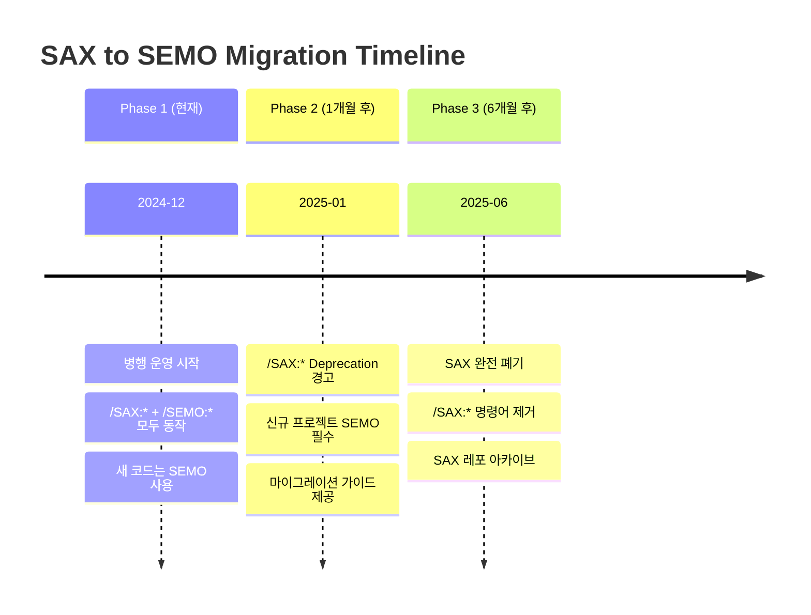

# 4편: 두 번째 위기 - 이름이 문제였다: SAX → SEMO 리브랜딩

> 시리즈: AI와 함께 일하는 법을 만들다 (4/7)

---

## 프롤로그: Google Gemini 팀의 충격적인 피드백

2024년 12월, Google AI Studio 팀과의 아키텍처 리뷰.

우리는 SAX 프레임워크를 자랑스럽게 발표했다. 8개월간의 노력, 토큰 최적화, 11개 패키지 구조...

그런데 Gemini 팀 엔지니어가 물었다.

**"SAX라는 이름... 혹시 'Simple API for XML' 아시죠?"**

순간 머릿속이 하얘졌다.

> **SAX는 이미 유명한 기술 용어였다.**
>
> - SAX (Simple API for XML): 1998년부터 사용된 XML 파싱 API
> - SAX (Symbolic Aggregate approXimation): 시계열 데이터 분석 알고리즘
> - SAX (Google's TPU library): Google의 JAX 기반 라이브러리

우리가 만든 "Semicolon AI Transformation"과 완전히 다른 것들이다.

---

## 문제: LLM 할루시네이션

이름 충돌이 왜 문제일까?

### LLM의 학습 데이터에 이미 "SAX"가 있다

```
사용자: "SAX 사용법 알려줘"

Claude (혼란):
"SAX는 XML 파싱 라이브러리입니다.
 org.xml.sax 패키지를 import하고..."

사용자: "아니, 그 SAX 말고... 세미콜론 SAX"

Claude (더 혼란):
"세미콜론... XML 파서의 세미콜론 처리?"
```

AI가 우리 프레임워크 "SAX"와 XML 라이브러리 "SAX"를 혼동하고 있었다.

### 실제 발생한 문제들

1. **엉뚱한 응답**: "SAX 스킬을 사용해줘" → XML 파싱 코드 생성
2. **컨텍스트 오염**: SAX 관련 학습 데이터가 응답에 섞임
3. **사용자 혼란**: 검색해도 우리 SAX가 안 나옴

---

## Gemini 리뷰의 핵심 지적 3가지

### 1. 네이밍 충돌

> "AI 시대의 네이밍은 SEO가 아닌 **LLM-friendly**가 핵심입니다."

기존 기술 용어와 겹치면:
- AI가 혼란스러워한다
- 할루시네이션 확률이 높아진다
- 사용자가 원하는 정보를 얻기 어렵다

**추천**: 고유하고 설명적인 이름 사용

### 2. 역할 기반 구조의 한계

> "요즘은 '1인 + N AI' 시대입니다. 역할 기반 패키지가 맞나요?"

우리의 11개 역할 기반 패키지:
```
sax-next (프론트엔드용)
sax-backend (백엔드용)
sax-qa (QA용)
...
```

하지만 현실에서는:
- 한 개발자가 여러 역할을 수행
- 풀스택 작업이 대부분
- 역할 경계가 모호해지는 추세

**추천**: 역할이 아닌 **기능** 중심으로 재구성

### 3. 분산 레포의 컨텍스트 파편화

> "11개 레포... AI가 전체 그림을 볼 수 없네요."

각 패키지가 독립된 Git 레포:
- sax-core, sax-next, sax-backend... 모두 별개 저장소
- AI가 여러 레포의 관계를 이해하기 어려움
- 크로스 패키지 작업에서 컨텍스트 손실

**추천**: 통합된 단일 구조

---

## 리브랜딩 결정: SAX → SEMO

### 새로운 이름: SEMO (Semicolon Orchestrate)

**왜 SEMO인가?**

1. **고유성**: "SEMO"는 기존 기술 용어와 충돌하지 않음
2. **설명성**: "Orchestrate"가 프레임워크의 본질을 표현
   - 여러 AI 에이전트를 **오케스트레이션**
   - 팀의 작업을 **조율**
3. **발음 용이**: 세모, 쎄모... 기억하기 쉬움

### 브랜드 정체성

```
SAX  = Semicolon AI Transformation (역할 기반)
SEMO = Semicolon Orchestrate (기능 기반)
```

단순 이름 변경이 아니라, **철학의 전환**이었다.

---

## 6개월 마이그레이션 계획

기존 SAX 사용자들을 위해 점진적 마이그레이션을 계획했다.



### Phase 1: 병행 운영 (2024년 12월)

```markdown
# 두 명령어 모두 동작
/SAX:help  → 작동 (SEMO로 리다이렉트)
/SEMO:help → 작동

# 응답에 경고 표시
[SEMO] Note: /SAX:* 명령어는 deprecated됩니다.
       /SEMO:* 명령어를 사용해주세요.
```

### Phase 2: Deprecation 경고 (2025년 1월)

```markdown
# /SAX:* 사용 시 경고
⚠️ [DEPRECATION WARNING]
/SAX:* 명령어는 2025년 6월에 폐기됩니다.
/SEMO:* 로 마이그레이션하세요.

마이그레이션 가이드: docs/MIGRATION_SAX_TO_SEMO.md
```

### Phase 3: 완전 폐기 (2025년 6월)

```markdown
# /SAX:* 사용 시 에러
❌ [ERROR] /SAX:* 명령어는 폐기되었습니다.
/SEMO:* 명령어를 사용하세요.

# SAX 레포지토리 아카이브
https://github.com/semicolon-devteam/sax-* → Archive
```

---

## 마이그레이션 자동화

기존 프로젝트의 마이그레이션을 돕기 위해 CLI 도구를 만들었다.

```bash
# SEMO CLI로 마이그레이션
npx @team-semicolon/semo-cli migrate

# 자동 변환 내용:
# - .claude/sax-* → .claude/semo-system/
# - CLAUDE.md 내 SAX 참조 → SEMO로 변경
# - /SAX:* 명령어 → /SEMO:* 변경
```

### 마이그레이션 전후 비교

**Before (SAX)**
```
.claude/
├── sax-core/
├── sax-next/
├── sax-backend/
└── CLAUDE.md (SAX 참조)
```

**After (SEMO)**
```
.claude/
├── CLAUDE.md (SEMO 참조)
├── settings.json
├── memory/
└── semo-system/
    ├── semo-core/
    └── semo-skills/
```

---

## 내부 문서 공개: Gemini 리뷰 전문

투명성을 위해, Gemini 팀에서 받은 리뷰 피드백 일부를 공개한다.

> ### Architecture Review Feedback
>
> **Reviewer**: Google AI Studio Team
> **Date**: 2024-12-05
>
> #### Positive Points
> - Orchestrator-First 정책은 훌륭한 아이디어
> - 투명성(Transparency) 원칙이 잘 지켜지고 있음
> - 토큰 최적화 접근법이 효과적
>
> #### Concerns
> 1. **Naming Collision**: "SAX"는 이미 널리 알려진 기술 용어.
>    LLM 학습 데이터에 포함되어 있어 혼란 야기 가능.
>
> 2. **Role-Based Architecture**: 현대 개발 환경에서 역할 경계가
>    모호해지고 있음. 기능 기반 설계 고려 필요.
>
> 3. **Repository Fragmentation**: 11개 분산 레포는 AI가 전체
>    컨텍스트를 파악하기 어렵게 만듦.
>
> #### Recommendations
> - 고유한 이름으로 리브랜딩 (예: SEMO, ORCH 등)
> - 역할 → 기능 기반으로 재구성
> - 단일 레포 또는 모노레포 구조 검토

---

## 의사결정 포인트

### Why: AI가 이해하기 쉬운 이름이 필요

- 기존 기술 용어와 충돌하면 할루시네이션 발생
- 사용자가 검색/학습하기 어려움
- 프레임워크의 정체성이 흐려짐

### Decision: 완전한 리브랜딩 + 점진적 마이그레이션

- SAX → SEMO (Semicolon Orchestrate)
- 6개월 마이그레이션 기간
- 자동 마이그레이션 도구 제공

### Learning: AI 시대의 네이밍 원칙

> **SEO 최적화가 아닌, LLM-friendly 최적화가 필요하다.**

좋은 AI 프레임워크 이름의 조건:
1. **고유성**: 기존 기술 용어와 충돌하지 않음
2. **설명성**: 기능/목적이 이름에서 드러남
3. **발음 용이**: 대화에서 쉽게 언급 가능
4. **검색 가능**: 인터넷 검색 시 고유 결과

---

## 다음 편 예고

리브랜딩과 함께, 아키텍처도 근본적으로 바꾸기로 했다.

11개의 역할 기반 패키지 → 3개의 기능 기반 레이어.
"프론트엔드 개발자용" → "코드 작성".

**5편: 역할 기반에서 기능 기반으로**에서 계속됩니다.

---

*이전 편: [토큰 지옥과 컨텍스트 파편화](./03-token-crisis.md)*
*다음 편: [역할 기반에서 기능 기반으로](./05-architecture-shift.md)*
