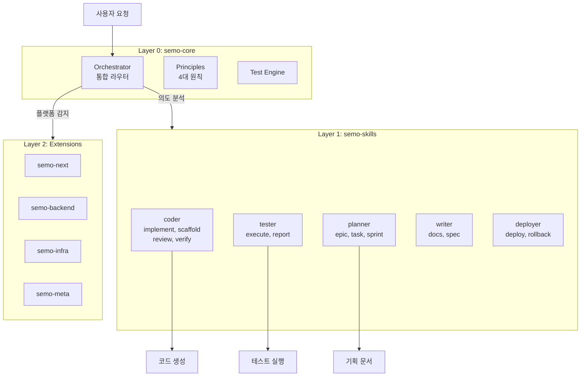

# 5편: 대전환 - 역할 기반에서 기능 기반으로

> 시리즈: AI와 함께 일하는 법을 만들다 (5/7)

---

## 프롤로그: "내가 프론트엔드 개발자인지 백엔드 개발자인지..."

2024년 12월, 리브랜딩 논의 중.

"저는 풀스택인데, sax-next랑 sax-backend 둘 다 써야 해요?"
"요즘 프론트엔드 개발자도 API 만드는데요?"
"QA가 테스트 코드 작성하는 것도, 개발자가 작성하는 것도 같은데..."

우리의 역할 기반 패키지 구조가 현실과 맞지 않았다.

> **"프론트엔드 개발자용" AI가 아니라,
> "코드 작성" AI가 필요한 거 아닐까?**

---

## 역할 기반의 한계

### 문제 1: 역할 경계의 모호함

2024년 개발 환경에서 역할 경계는 흐릿해지고 있다.

```
전통적 역할          현대 현실
─────────────────────────────────
프론트엔드 개발자   → 풀스택 개발자
백엔드 개발자       → API도, 프론트도
QA                 → 개발자가 테스트 작성
DevOps             → 모든 개발자가 CI/CD
PO/PM              → 개발자도 기획 참여
```

### 문제 2: 중복되는 스킬

각 역할별 패키지에 비슷한 스킬이 중복되어 있었다.

```
sax-next의 "implement" 스킬
sax-backend의 "implement" 스킬
sax-mvp의 "implement" 스킬

→ 모두 "코드 구현"이라는 같은 기능
→ 플랫폼만 다를 뿐
```

### 문제 3: 사용자 경험의 복잡성

```
# 사용자가 해야 하는 일 (Before)
"로그인 기능 만들어줘"

AI: "어떤 패키지를 사용할까요?"
    - sax-next (프론트엔드)
    - sax-backend (백엔드)
    - sax-mvp (빠른 프로토타입)

사용자: "음... 둘 다 필요한데?"
```

---

## 새로운 설계: 기능 기반 3-Layer Architecture

### 핵심 아이디어

> **역할이 아닌 "기능"으로 분류하자.**
>
> "프론트엔드 개발자용" → "코드 작성"
> "QA용" → "테스트"
> "PO/PM용" → "기획"

### 3-Layer 구조

```
Layer 0: semo-core
├── Orchestrator (통합 라우터)
├── Principles (4대 원칙)
└── Common Commands

Layer 1: semo-skills (기능별 스킬)
├── coder/     (코드 작성)
├── tester/    (테스트)
├── planner/   (기획)
├── writer/    (문서)
└── deployer/  (배포)

Layer 2: Extensions (플랫폼별 확장)
├── semo-next      (Next.js 특화)
├── semo-backend   (Spring 특화)
├── semo-infra     (인프라 특화)
└── semo-meta      (SEMO 자체 관리)
```



---

## 149개 스킬의 재분류

기존 11개 패키지에 흩어져 있던 스킬들을 기능별로 재분류했다.

### coder (코드 작성)

```
기존 위치                    → 새 위치
────────────────────────────────────────
sax-next/implement         → semo-skills/coder/implement
sax-backend/implement      → semo-skills/coder/implement
sax-ms/implement          → semo-skills/coder/implement
sax-mvp/scaffold          → semo-skills/coder/scaffold
sax-*/review              → semo-skills/coder/review
```

### tester (테스트)

```
sax-qa/execute            → semo-skills/tester/execute
sax-qa/report             → semo-skills/tester/report
sax-*/verify              → semo-skills/tester/verify
```

### planner (기획)

```
sax-po/epic               → semo-skills/planner/epic
sax-po/task               → semo-skills/planner/task
sax-pm/sprint             → semo-skills/planner/sprint
sax-pm/roadmap            → semo-skills/planner/roadmap
```

### writer (문서)

```
sax-po/spec               → semo-skills/writer/spec
sax-design/ui-spec        → semo-skills/writer/spec
sax-*/docs                → semo-skills/writer/docs
```

### deployer (배포)

```
sax-infra/deploy          → semo-skills/deployer/deploy
sax-infra/rollback        → semo-skills/deployer/rollback
sax-infra/docker          → semo-skills/deployer/containerize
```

---

## 플랫폼 자동 감지

가장 큰 UX 개선: **플랫폼 자동 감지**.

### Before: 명시적 지정 필요

```
사용자: "[next] 버튼 컴포넌트 만들어줘"
        ^^^^^^
        플랫폼 태그 필요
```

### After: 자동 감지

```
사용자: "버튼 컴포넌트 만들어줘"

[SEMO] Orchestrator: 플랫폼 자동 감지
       - next.config.js 발견 → Next.js
       - package.json의 dependencies 확인

[SEMO] Skill 위임: semo-skills/coder/implement (platform: nextjs)
```

### 감지 로직

```typescript
function detectPlatform(projectRoot: string): Platform {
  // 1. 설정 파일 기반 감지
  if (exists('next.config.js') || exists('next.config.ts')) {
    return 'nextjs';
  }
  if (exists('pom.xml') || exists('build.gradle')) {
    return 'spring';
  }
  if (exists('Dockerfile') || exists('docker-compose.yml')) {
    return 'docker';
  }

  // 2. package.json 의존성 기반 감지
  const pkg = readPackageJson();
  if (pkg.dependencies?.next) return 'nextjs';
  if (pkg.dependencies?.react) return 'react';
  if (pkg.dependencies?.vue) return 'vue';

  // 3. 폴백: MVP 모드
  return 'mvp';
}
```

---

## 단일 Orchestrator로 통합

### Before: 11개의 Orchestrator

각 패키지마다 자체 Orchestrator가 있었다.

```
sax-core/orchestrator
sax-next/orchestrator      (core 상속)
sax-backend/orchestrator   (core 상속)
...
```

문제:
- 패키지 간 충돌 가능
- 우선순위 혼란
- 디버깅 어려움

### After: 1개의 통합 Orchestrator

```
semo-core/orchestrator (유일한 Orchestrator)
    ↓
의도 분석 → 기능 판단 → 플랫폼 감지 → 스킬 위임
```

모든 요청이 단일 경로를 통과:

```markdown
[SEMO] Orchestrator: 의도 분석 완료
       - 의도: 코드 구현
       - 기능: coder
       - 플랫폼: nextjs (자동 감지)

[SEMO] Skill 위임: semo-skills/coder/implement (platform: nextjs)
```

---

## Before/After 비교

### 사용자 경험

**Before (SAX, 역할 기반)**
```
사용자: "[next] 로그인 폼 만들어줘"

[SAX] Orchestrator: sax-next로 라우팅
[SAX] Agent: sax-next/coder 호출

# 백엔드도 필요하면?
사용자: "[backend] 로그인 API 만들어줘"

[SAX] Orchestrator: sax-backend로 라우팅
[SAX] Agent: sax-backend/coder 호출

# 두 결과를 수동으로 연결해야 함
```

**After (SEMO, 기능 기반)**
```
사용자: "로그인 폼 만들어줘"

[SEMO] Orchestrator: 의도 분석 완료 → 코드 구현 요청
       플랫폼 자동 감지: Next.js (next.config.js 발견)

[SEMO] Skill 위임: semo-skills/coder/implement (platform: nextjs)

# 풀스택이 필요하면?
사용자: "로그인 기능 전체를 구현해줘"

[SEMO] Orchestrator: 풀스택 작업 감지
       - 프론트엔드: Next.js
       - 백엔드: Spring (pom.xml 발견)

[SEMO] 계획:
       1. API 인터페이스 정의 (공통)
       2. 백엔드 구현 (coder + spring)
       3. 프론트엔드 구현 (coder + nextjs)

# 자동으로 연결된 결과
```

### 설치 복잡성

**Before**
```bash
# 필요한 것만 개별 설치
git submodule add sax-core
git submodule add sax-next
git submodule add sax-backend
git submodule add sax-qa
# 업데이트도 각각...
```

**After**
```bash
# 원클릭 설치
npx @team-semicolon/semo-cli init

# 자동으로 전체 구조 설정
# 필요한 Extension만 활성화
```

---

## Try it yourself: 플랫폼 자동 감지 체험

SEMO가 설치된 프로젝트에서 직접 체험해보자.

```bash
# Next.js 프로젝트에서
echo '{}' > next.config.js

# Claude Code에서:
사용자: "버튼 만들어줘"

[SEMO] Orchestrator: 플랫폼 자동 감지 → Next.js
[SEMO] Skill 위임: semo-skills/coder/implement (platform: nextjs)

# React 컴포넌트 + Tailwind CSS 코드 생성
```

```bash
# Spring 프로젝트에서
echo '<project/>' > pom.xml

# Claude Code에서:
사용자: "API 만들어줘"

[SEMO] Orchestrator: 플랫폼 자동 감지 → Spring
[SEMO] Skill 위임: semo-skills/coder/implement (platform: spring)

# Spring Boot Controller + Service 코드 생성
```

```bash
# 설정 파일이 없으면?
rm next.config.js pom.xml

사용자: "로그인 기능 만들어줘"

[SEMO] Orchestrator: 플랫폼 자동 감지 → MVP 모드 (폴백)
[SEMO] Skill 위임: semo-skills/coder/scaffold (platform: mvp)

# 빠른 프로토타입 코드 생성
```

---

## 의사결정 포인트

### Why: AI는 역할이 아닌 기능으로 사고

- 사용자는 "프론트엔드 코드"가 아니라 "코드"를 원함
- AI는 "QA 작업"이 아니라 "테스트"를 이해함
- 역할 경계가 모호한 현대 개발 환경

### Decision: 기능 기반 + 자동 컨텍스트 감지

- 11개 역할 기반 패키지 → 5개 기능 기반 스킬
- 명시적 플랫폼 지정 → 자동 감지
- 11개 Orchestrator → 1개 통합 Orchestrator

### Trade-off: 명시성 감소 vs 사용성 증가

**얻은 것**
- 단순한 설치 (원클릭)
- 자연스러운 요청 ("로그인 만들어줘")
- 플랫폼 전환이 자유로움

**잃은 것**
- 명시적 제어 감소 (자동 감지가 틀릴 수 있음)
- 역할별 최적화 감소 (범용 스킬)
- 학습 곡선 (기존 SAX 사용자)

**해결책**: 명시적 오버라이드 지원

```markdown
# 자동 감지 결과가 틀렸을 때
사용자: "[platform: vue] 버튼 만들어줘"

[SEMO] Orchestrator: 명시적 플랫폼 지정 → Vue
       (자동 감지 Next.js 무시)
```

---

## 다음 편 예고

아키텍처는 바꿨다. 하지만 팀 전체가 쉽게 사용하려면?

토큰 설정, 환경 구성 같은 번거로운 작업을 자동화해야 했다. 특히 Slack 알림을 위한 토큰... 각 개발자가 설정하게 할 순 없었다.

**6편: 팀 공용 토큰과 원클릭 설치**에서 계속됩니다.

---

*이전 편: [이름이 문제였다: SAX → SEMO 리브랜딩](./04-rebranding.md)*
*다음 편: [팀 공용 토큰과 원클릭 설치](./06-infrastructure.md)*
