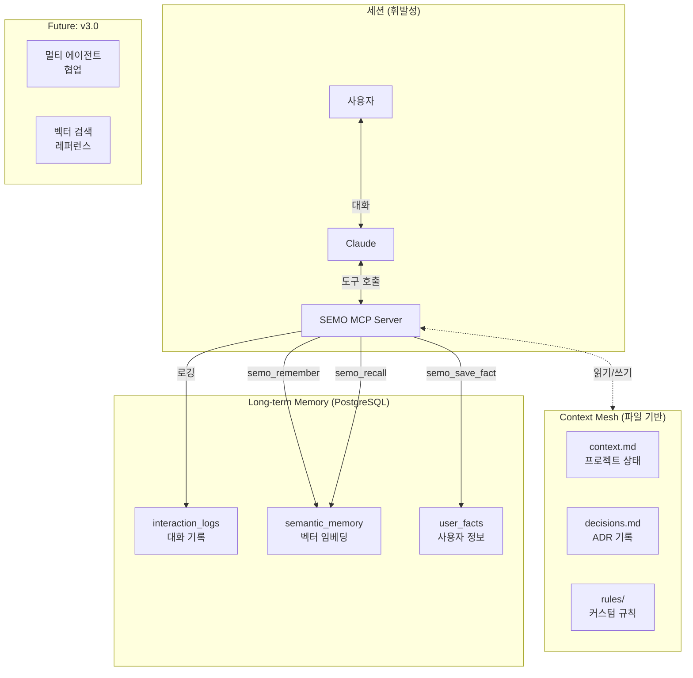

# 7편: 미래 - AI 에이전트가 기억하는 세상

> 시리즈: AI와 함께 일하는 법을 만들다 (7/7, 마지막)

---

## 프롤로그: "어제 뭘 작업했더라?"

2024년 12월, SEMO v2.0 안정화 후.

"어제 로그인 기능 작업하던 거 이어서 해줘."
"죄송합니다, 이전 세션의 내용을 기억하지 못합니다."

매번 처음부터 설명해야 했다. 프로젝트 구조, 기술 스택, 지금까지 한 작업...

> **세션이 끝나면 AI의 기억도 리셋된다.**

이걸 바꿀 수 없을까?

---

## 현재의 한계: 휘발성 컨텍스트

### AI의 기억 구조

```
세션 시작
    ↓
CLAUDE.md 로드 (프로젝트 규칙)
    ↓
대화 시작
    ↓
... 작업 ...
    ↓
세션 종료 → 모든 대화 내용 삭제
```

### 잃어버리는 것들

1. **대화 히스토리**: "왜 이 구조로 결정했더라?"
2. **사용자 선호**: "이 사람은 함수형을 좋아해"
3. **프로젝트 상태**: "현재 스프린트 23, 로그인 기능 50% 완료"
4. **의사결정 맥락**: "성능 문제로 Redis 대신 in-memory 선택"

---

## 해결책 1: Context Mesh (파일 기반 메모리)

### 개념

> **세션 간 유지되어야 할 정보를 파일로 저장.**

```
.claude/memory/
├── context.md      # 프로젝트 현재 상태
├── decisions.md    # 아키텍처 결정 기록 (ADR)
└── rules/          # 프로젝트별 커스텀 규칙
    ├── naming.md
    └── testing.md
```

### context.md 예시

```markdown
# 프로젝트 컨텍스트

## 현재 상태
- 스프린트: Sprint 23
- 진행 중 작업: 로그인 기능 리팩토링
- 기술 스택: Next.js 14, TypeScript, Prisma, PostgreSQL

## 최근 변경
- 2024-12-12: 인증 미들웨어 추가
- 2024-12-10: API 라우트 구조 변경
- 2024-12-08: Prisma 스키마 업데이트

## 주요 경로
- 인증: /app/(auth)/
- API: /app/api/
- 컴포넌트: /components/ui/

## 팀 컨벤션
- 커밋 메시지: Conventional Commits
- 브랜치: feature/, fix/, chore/
- PR 템플릿: .github/PULL_REQUEST_TEMPLATE.md
```

### decisions.md 예시 (ADR 형식)

```markdown
# 아키텍처 결정 기록

## ADR-001: 인증 방식 선택

**날짜**: 2024-12-05
**상태**: 승인됨

### 맥락
사용자 인증 시스템 구현 필요

### 결정
JWT + HttpOnly Cookie 방식 선택

### 대안 검토
| 방식 | 장점 | 단점 |
|------|------|------|
| Session | 보안 강함 | 확장성 낮음 |
| JWT (localStorage) | 확장성 | XSS 취약 |
| **JWT (Cookie)** | **균형** | 복잡성 |

### 결과
- /lib/auth.ts에 JWT 유틸리티 구현
- 미들웨어에서 토큰 검증
- 리프레시 토큰 구현 예정

---

## ADR-002: 상태 관리 라이브러리

**날짜**: 2024-12-08
**상태**: 승인됨

### 결정
Zustand 선택 (Redux 대신)

### 이유
- 보일러플레이트 최소화
- TypeScript 친화적
- 번들 크기 작음
```

### memory 스킬

SEMO는 `memory` 스킬로 이 파일들을 자동 관리한다.

```markdown
사용자: "오늘 작업한 내용 저장해줘"

[SEMO] Skill: memory/save
       context.md 업데이트 완료

## 저장된 내용
- 최근 변경에 "2024-12-12: 댓글 기능 구현" 추가
- 진행 중 작업 업데이트
```

---

## 해결책 2: PostgreSQL 기반 장기 기억

Context Mesh는 좋지만 한계가 있다:
- 텍스트 검색만 가능
- 유사도 검색 불가
- 대량 데이터 처리 어려움

### 비전: 벡터 임베딩 + 하이브리드 검색

```
사용자: "지난달에 성능 문제 어떻게 해결했더라?"

[SEMO] Memory: 관련 기억 검색 중...
       - 벡터 유사도 검색: "성능", "최적화"
       - 시간 필터: 지난 30일

[SEMO] 관련 기억 발견:
       1. ADR-005: Redis 캐싱 도입 (2024-11-15)
       2. 대화 기록: "N+1 쿼리 최적화" (2024-11-20)
       3. 커밋: "feat: memoization 적용" (2024-11-22)
```

### 구현 계획 (Phase 1-6)



#### Phase 1-2: 인프라

```sql
-- Supabase PostgreSQL with pgvector
CREATE EXTENSION IF NOT EXISTS vector;
CREATE EXTENSION IF NOT EXISTS pg_net;
CREATE EXTENSION IF NOT EXISTS pg_cron;

-- 대화 기록 테이블
CREATE TABLE interaction_logs (
  id UUID PRIMARY KEY DEFAULT gen_random_uuid(),
  session_id TEXT NOT NULL,
  user_id TEXT NOT NULL,
  message_type TEXT, -- 'user' | 'assistant'
  content TEXT NOT NULL,
  metadata JSONB,
  created_at TIMESTAMPTZ DEFAULT NOW()
);

-- 시맨틱 메모리 (벡터 임베딩)
CREATE TABLE semantic_memory (
  id UUID PRIMARY KEY DEFAULT gen_random_uuid(),
  content TEXT NOT NULL,
  embedding vector(1536),  -- OpenAI ada-002 dimension
  metadata JSONB,
  created_at TIMESTAMPTZ DEFAULT NOW()
);

-- 벡터 인덱스
CREATE INDEX ON semantic_memory
USING ivfflat (embedding vector_cosine_ops)
WITH (lists = 100);
```

#### Phase 3-4: 지능형 메모리

```typescript
// MCP 도구: semo_remember
async function semoRemember(content: string, metadata: object) {
  // 1. 텍스트 임베딩 생성
  const embedding = await generateEmbedding(content);

  // 2. PostgreSQL에 저장
  await db.insert({
    table: 'semantic_memory',
    data: { content, embedding, metadata }
  });

  return { success: true };
}

// MCP 도구: semo_recall
async function semoRecall(query: string, limit: number = 5) {
  // 1. 쿼리 임베딩 생성
  const queryEmbedding = await generateEmbedding(query);

  // 2. 하이브리드 검색 (벡터 + 키워드)
  const results = await db.query(`
    SELECT content, metadata,
           1 - (embedding <=> $1) as similarity
    FROM semantic_memory
    WHERE 1 - (embedding <=> $1) > 0.7
    ORDER BY similarity DESC
    LIMIT $2
  `, [queryEmbedding, limit]);

  return results;
}
```

#### Phase 5-6: 보안 및 최적화

```typescript
// Row Level Security
await db.query(`
  ALTER TABLE semantic_memory ENABLE ROW LEVEL SECURITY;

  CREATE POLICY "Users can only access own memories"
  ON semantic_memory
  FOR ALL
  USING (metadata->>'user_id' = current_user_id());
`);

// 자동 정리 (pg_cron)
await db.query(`
  SELECT cron.schedule(
    'cleanup-old-memories',
    '0 0 * * *',  -- 매일 자정
    $$DELETE FROM semantic_memory
      WHERE created_at < NOW() - INTERVAL '90 days'$$
  );
`);
```

---

## 비전: 멀티 에이전트 협업

### 현재: 1 사용자 + 1 AI

```
사용자 ←→ Claude (SEMO)
```

### 미래: 팀 단위 AI 어시스턴트

```
사용자 A ←→ Claude A (SEMO)
                ↕
          [공유 메모리]
                ↕
사용자 B ←→ Claude B (SEMO)
```

### 시나리오

```markdown
# 사용자 A (프론트엔드)
"로그인 폼 만들었어. API 스펙은 decisions.md에 있어"

[SEMO] Memory: API 스펙 저장됨
       - POST /api/auth/login
       - Request: { email, password }
       - Response: { token, user }

# 사용자 B (백엔드)
"로그인 API 만들어야 하는데, 프론트에서 정한 스펙 알려줘"

[SEMO] Memory: 관련 기억 검색
       → 사용자 A가 정의한 API 스펙 발견

"다음 스펙으로 구현하면 됩니다:
 POST /api/auth/login
 Request: { email: string, password: string }
 Response: { token: string, user: { id, name } }"
```

---

## Try it yourself: Context Mesh 활용하기

### 1. memory 디렉토리 확인

```bash
ls -la .claude/memory/
# context.md
# decisions.md
```

### 2. context.md 수정

```markdown
# .claude/memory/context.md

## 프로젝트 상태
- 현재 스프린트: Sprint 23
- 진행 중: 로그인 기능 리팩토링
- 기술 스택: Next.js 14, TypeScript, Prisma

## 최근 변경
- 2024-12-12: 인증 미들웨어 추가
- 2024-12-10: API 라우트 구조 변경
```

### 3. Claude Code에서 활용

```markdown
사용자: "현재 프로젝트 상태 알려줘"

[SEMO] Memory: context.md 참조

## 현재 프로젝트 상태
- 스프린트: Sprint 23
- 진행 중인 작업: 로그인 기능 리팩토링
- 최근 변경:
  - 12일: 인증 미들웨어 추가
  - 10일: API 라우트 구조 변경
```

### 4. 작업 내용 저장

```markdown
사용자: "오늘 댓글 기능 작업한 거 저장해줘"

[SEMO] Skill: memory/save

✅ context.md 업데이트 완료
- 최근 변경: "2024-12-12: 댓글 기능 구현" 추가
```

---

## 로드맵

### v2.2 (2025 Q1): 벡터 검색 기반 레퍼런스

```markdown
사용자: "비슷한 컴포넌트 있어?"

[SEMO] Memory: 프로젝트 내 유사 코드 검색
       - 벡터 임베딩으로 코드 유사도 분석
       - components/ui/Button.tsx (similarity: 0.85)
       - components/ui/IconButton.tsx (similarity: 0.72)
```

### v3.0 (2025 Q2): 멀티 에이전트 협업

```markdown
# 팀 공유 메모리
- 아키텍처 결정 기록
- API 스펙 공유
- 진행 상황 동기화

# 에이전트 간 통신
- "프론트엔드 에이전트가 API 스펙 변경함"
- "백엔드 에이전트에게 알림"
```

---

## 11개월의 교훈: 에필로그

SAX에서 SEMO로, 11개월의 여정을 마무리하며.

### 배운 것들

1. **AI는 도구가 아니라 팀원처럼 대해야 한다**
   - 규칙을 가르쳐야 한다
   - 컨텍스트를 공유해야 한다
   - 피드백을 반영해야 한다

2. **네이밍은 SEO가 아닌 LLM-friendly로**
   - AI가 이해하기 쉬운 이름
   - 기존 기술 용어와 충돌 피하기
   - 설명적이고 고유한 이름

3. **토큰 경제학을 무시하면 안 된다**
   - 토큰 = 비용 + 속도 + 품질
   - Progressive Disclosure
   - 필요할 때만 컨텍스트 로드

4. **역할 기반 < 기능 기반**
   - AI는 "프론트엔드 개발자"가 아님
   - "코드 작성", "테스트", "기획"으로 분류
   - 자동 플랫폼 감지

5. **온보딩 마찰 = 도입 실패**
   - 30초 설치 목표
   - 팀 토큰 자동 주입
   - 설치만 하면 바로 사용

### 앞으로의 방향

AI 에이전트는 점점 더 "기억"하고, "협업"하고, "학습"할 것이다.

SEMO는 그 여정을 함께 할 것이다.

---

## 시리즈를 마치며

7편의 포스팅을 읽어주셔서 감사합니다.

질문, 피드백, 기여는 언제나 환영합니다:
- [GitHub Issues](https://github.com/semicolon-devteam/semo/issues)
- [SEMO Feedback](/SEMO:feedback)

> **"AI와 함께 일하는 법을 만들다"**
>
> 이제 당신의 팀도 시작해보세요.

```bash
npx @team-semicolon/semo-cli init
```

---

*이전 편: [팀 공용 토큰과 원클릭 설치](./06-infrastructure.md)*
*시리즈 목차: [AI와 함께 일하는 법을 만들다](./00-series-index.md)*
