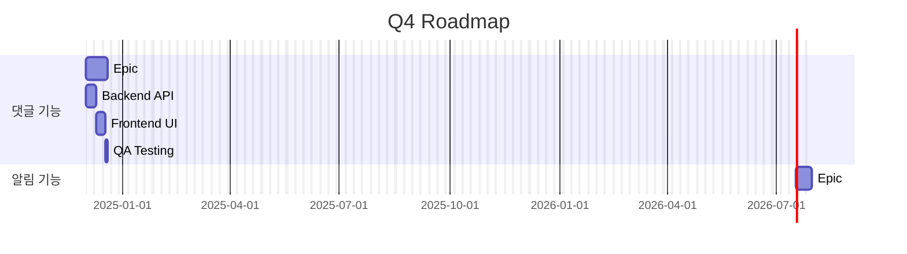
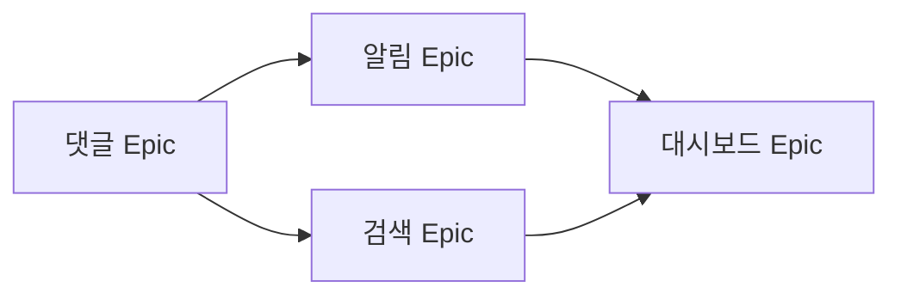

> **시스템 메시지**: 이 Skill이 호출되면 `[SEMO] Skill: generate-roadmap 호출` 메시지를 첫 줄에 출력하세요.

# generate-roadmap Skill

> Epic 기반 Roadmap 생성 및 시각화

## Purpose

Epic들을 기반으로 프로젝트 Roadmap을 생성하고 Mermaid 차트로 시각화합니다.

## Workflow

```
Roadmap 생성 요청
    ↓
1. Epic 목록 조회 (docs 레포)
2. Epic별 예상 기간 계산
3. 의존성 분석
4. Mermaid Gantt 차트 생성
5. Roadmap 문서 생성
    ↓
완료
```

## Input

```yaml
period: "Q4"                      # 선택 (기간 필터)
format: "mermaid"                 # 선택 (mermaid|markdown)
include_completed: false          # 선택 (완료된 Epic 포함)
```

## Output

```markdown
# 🗺️ 2024 Q4 Roadmap

**기간**: 2024-10-01 ~ 2024-12-31

## 📅 타임라인



## 📊 Epic 현황

| Epic | 상태 | 진행률 | 시작 | 예상 완료 |
|------|------|--------|------|----------|
| 댓글 시스템 | 🔄 진행중 | 60% | 12/01 | 12/14 |
| 알림 시스템 | ⏳ 대기 | 0% | 12/15 | 12/28 |
```

## API 호출

### Epic 목록 조회

```bash
# epic 라벨 Issue 조회
gh issue list \
  --repo semicolon-devteam/docs \
  --label "epic" \
  --state all \
  --json number,title,state,labels,createdAt,closedAt
```

### Epic 상세 정보

```bash
# Epic의 Sub-issues (Task) 조회
gh api graphql -f query='
{
  repository(owner: "semicolon-devteam", name: "docs") {
    issue(number: {epic_number}) {
      title
      state
      body
      timelineItems(first: 100, itemTypes: [CROSS_REFERENCED_EVENT]) {
        nodes {
          ... on CrossReferencedEvent {
            source {
              ... on Issue {
                number
                title
                state
                labels(first: 10) { nodes { name } }
              }
            }
          }
        }
      }
    }
  }
}'
```

## Epic 기간 계산

```javascript
function calculateEpicDuration(epic) {
  // Task들의 총 Point
  const totalPoints = epic.tasks.reduce((sum, t) => sum + t.points, 0);

  // Velocity 기반 기간 계산
  const velocity = 3.5; // pt/day
  const baseDays = totalPoints / velocity;

  // 버퍼 추가 (20%)
  const withBuffer = baseDays * 1.2;

  return Math.ceil(withBuffer);
}
```

## Mermaid Gantt 생성

```javascript
function generateGantt(epics) {
  let gantt = `gantt
    title Project Roadmap
    dateFormat YYYY-MM-DD
    excludes weekends\n`;

  for (const epic of epics) {
    gantt += `\n    section ${epic.title}\n`;

    // Epic 자체
    if (epic.dependency) {
      gantt += `    Epic: ${epic.title} :${epic.id}, after ${epic.dependency}, ${epic.duration}d\n`;
    } else {
      gantt += `    Epic: ${epic.title} :${epic.id}, ${epic.startDate}, ${epic.duration}d\n`;
    }

    // 주요 Task
    for (const task of epic.keyTasks) {
      gantt += `    ${task.title} :${task.id}, after ${task.dependency || epic.id}, ${task.duration}d\n`;
    }
  }

  return gantt;
}
```

## 의존성 다이어그램



## 완료 메시지

```markdown
[SEMO] Skill: generate-roadmap 완료

# 🗺️ {period} Roadmap

**기간**: {start_date} ~ {end_date}
**Epic 수**: {epic_count}

## 📅 타임라인

```mermaid
{gantt_chart}
```

## 📊 Epic 현황

| Epic | 상태 | 진행률 | 예상 완료 |
|------|------|--------|----------|
{epic_rows}

## 🔗 의존성

```mermaid
{dependency_graph}
```

## ⚠️ 리스크
{risk_section}
```
