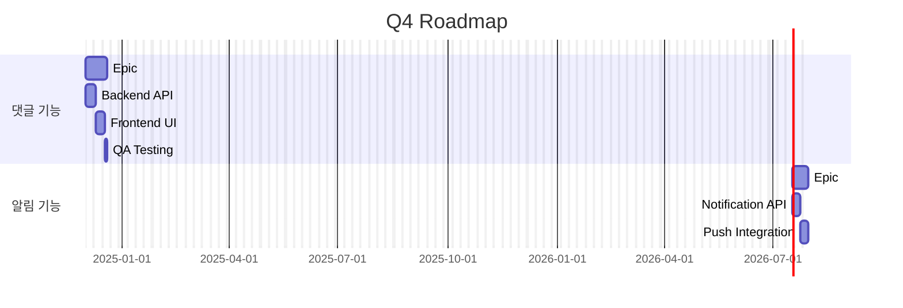
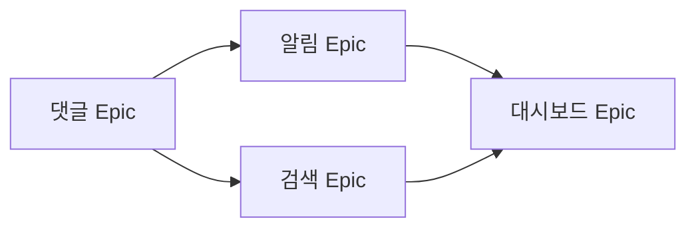

# /SAX:roadmap - Roadmap 관리 커맨드

> Epic 기반 Roadmap 생성 및 시각화

## 사용법

```bash
/SAX:roadmap <action> [options]
```

## Actions

### generate - Roadmap 생성

```bash
/SAX:roadmap generate
/SAX:roadmap generate --period Q4
/SAX:roadmap generate --format mermaid
```

**파라미터**:
- `--period`: 대상 기간 (Q1, Q2, Q3, Q4, 2024 등)
- `--format`: 출력 형식 (markdown, mermaid)
- `--include-completed`: 완료된 Epic 포함

**동작**:
1. Epic 목록 조회
2. 기간 계산
3. 의존성 분석
4. Mermaid Gantt 차트 생성

---

### view - Roadmap 조회

```bash
/SAX:roadmap view
/SAX:roadmap view --epic #123
```

현재 Roadmap 또는 특정 Epic의 일정을 조회합니다.

---

### iteration - Iteration 현황

```bash
/SAX:roadmap iteration list
/SAX:roadmap iteration "12월 1/4"
```

Iteration 목록 조회 또는 특정 Iteration 현황을 확인합니다.

---

## 출력 예시

### Mermaid Gantt 차트

```markdown
# 🗺️ 2024 Q4 Roadmap

**기간**: 2024-10-01 ~ 2024-12-31

## 📅 타임라인


```

### Epic 현황 테이블

```markdown
## 📊 Epic 현황

| Epic | 상태 | 진행률 | 시작 | 예상 완료 |
|------|------|--------|------|----------|
| 댓글 시스템 | 🔄 진행중 | 60% | 12/01 | 12/14 |
| 알림 시스템 | ⏳ 대기 | 0% | 12/15 | 12/28 |
| 관리자 대시보드 | ⏳ 대기 | 0% | 01/02 | 01/20 |
```

### 의존성 다이어그램

```markdown
## 🔗 의존성


```

## Options

### --period

대상 기간을 지정합니다.

```bash
/SAX:roadmap generate --period Q4
/SAX:roadmap generate --period "2024-12"
/SAX:roadmap generate --period 2025
```

### --format

출력 형식을 지정합니다.

| 형식 | 설명 |
|------|------|
| markdown | 기본 마크다운 |
| mermaid | Mermaid 차트 포함 |
| json | JSON 데이터 |

### --include-completed

완료된 Epic을 포함합니다.

```bash
/SAX:roadmap generate --include-completed
```

## Routing

이 커맨드는 `roadmap-planner` Agent에게 위임됩니다.

```markdown
[SAX] Orchestrator: 의도 분석 완료 → Roadmap 관리

[SAX] Agent 위임: roadmap-planner (사유: Roadmap {action} 요청)
```

## 연관 Skills

- `generate-roadmap`: Roadmap 생성
- `sync-project-status`: Projects 상태 동기화
