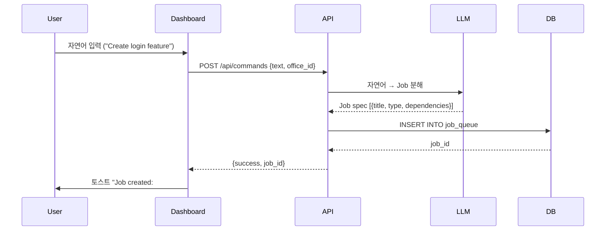
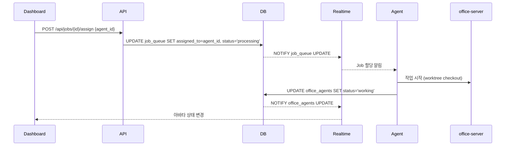
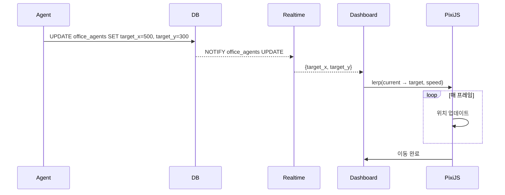

# SEMO Dashboard — 메인 화면 기획서

**프로젝트**: SEMO (Semicolon Orchestrate)  
**문서 버전**: v0.1  
**작성자**: PlanClaw  
**작성일**: 2026-03-12  
**상태**: Spec Ready

---

## 📋 Overview

### 목적
SEMO의 메인 대시보드는 사용자가 가상 오피스를 시각적으로 모니터링하고, 자연어 커맨드로 AI 에이전트들에게 작업을 지시하며, 실시간으로 작업 진행 상황을 추적할 수 있는 통합 인터페이스입니다.

### 핵심 가치
- **실시간 시각화**: GatherTown 스타일 2D 가상 오피스에서 에이전트 활동을 직관적으로 확인
- **자연어 인터페이스**: 복잡한 개발 워크플로우를 자연어로 간단히 지시
- **투명한 모니터링**: 작업 큐, 에이전트 상태, 워크플로우 진행을 한눈에 파악

### 사용자 페르소나
- **프로젝트 매니저**: 전체 작업 흐름 모니터링, 병목 지점 파악
- **개발자**: 특정 작업 배정, 에이전트 간 협업 상태 확인
- **팀 리더**: 오피스 설정, 워크플로우 정의 및 실행

---

## 🎨 Layout Design

### 전체 구조 (3-Panel Layout)

```
┌─────────────────────────────────────────────────────────────┐
│  Header: Office Name | Status | Active Agents Count         │
├──────────────┬────────────────────────────┬─────────────────┤
│              │                            │                 │
│  Left Panel  │     Main Canvas            │   Right Panel   │
│  Order Zone  │     Office View            │   Monitor       │
│              │                            │                 │
│  200px       │     flex-grow              │   300px         │
│  fixed       │                            │   collapsible   │
│              │                            │                 │
└──────────────┴────────────────────────────┴─────────────────┘
```

### Responsive Breakpoints (Phase 2)
- Desktop (>1200px): 3-panel
- Tablet (768px-1200px): 2-panel (Left + Main, Right는 drawer)
- Mobile (<768px): Single panel view (탭 전환)

---

## 🔷 Component Specifications

### 1. Header Bar

**위치**: 최상단 고정  
**높이**: 60px

**구성 요소**:
- **Office Name** (좌측)
  - 현재 오피스명 표시 (`offices.name`)
  - 오피스 선택 드롭다운 (여러 오피스 전환)
  
- **Status Badge** (중앙)
  - Active (초록) / Paused (노랑) / Archived (회색)
  - 클릭 → 상태 변경 확인 모달

- **Metrics** (우측)
  - Active Agents: `X / Y` (활성 에이전트 수 / 전체)
  - Running Jobs: `N` (진행 중 작업 수)
  - 아이콘 + 숫자 형태

- **User Menu** (최우측)
  - 프로필 아이콘
  - Logout, Settings

**데이터 소스**:
- `offices` 테이블
- `office_dashboard` 뷰

---

### 2. Left Panel — Order Zone

**너비**: 200px (fixed)  
**배경색**: `#F5F5F5` (연한 회색)

#### 2.1 Command Input (상단 고정)

**UI**:
- 텍스트 입력창 (multi-line, auto-expand 최대 5줄)
- Placeholder: `"What should we build today?"`
- Submit 버튼 (파란색, 아이콘: ➤)
- 키보드 단축키: `Enter` (전송), `Shift+Enter` (줄바꿈)

**동작**:
1. 사용자가 자연어 입력 (예: "Create a login feature with OAuth")
2. Submit 시 backend API 호출: `POST /api/commands`
3. 응답: Job Queue 생성 결과 (job_id, workflow_id)
4. 입력창 초기화 + 성공 토스트 메시지

**에러 처리**:
- 빈 입력: "Please enter a command" 경고
- API 실패: "Failed to process command. Please try again."

#### 2.2 Recent Commands (히스토리)

**UI**:
- 최근 5개 명령어 리스트
- 각 항목: 텍스트 요약 (최대 50자, truncate with "...")
- 클릭 시 재실행 확인 모달

**데이터**:
- LocalStorage 저장 (세션 유지)
- 포맷: `[{text, timestamp, job_id}]`

#### 2.3 Quick Actions (아코디언)

**섹션 1: New Workflow**
- `workflow_definitions` 목록 (이름 + 설명)
- 클릭 → 워크플로우 실행 모달 (파라미터 입력)

**섹션 2: Assign Job**
- `ready_jobs` 뷰 데이터
- Job 카드: 제목 + priority badge
- 클릭 → 에이전트 선택 드롭다운

**섹션 3: Office Controls**
- Pause All Agents (일시정지 버튼)
- Resume All Agents (재시작 버튼)

#### 2.4 Office Settings (하단 고정)

**UI**:
- Grid Visibility 토글 (체크박스)
- Agent Speed Slider (0.5x ~ 2.0x)
- 설정 아이콘 (톱니바퀴) → 상세 설정 모달

---

### 3. Main Canvas — Office View

**크기**: flex-grow (화면 중앙 전체 사용)  
**렌더링**: PixiJS v8

#### 3.1 Background Layer

**데이터 소스**: `offices.layout_config`
```json
{
  "width": 1920,
  "height": 1080,
  "background": "/assets/office-bg.png",
  "furniture": [
    {"type": "desk", "x": 100, "y": 200, "sprite": "/assets/desk.png"},
    {"type": "chair", "x": 120, "y": 220, "sprite": "/assets/chair.png"}
  ]
}
```

**렌더링**:
- Background 이미지를 Canvas 크기에 맞게 scale
- Furniture 스프라이트를 `(x, y)` 좌표에 배치

#### 3.2 Grid Overlay (Optional)

**표시 조건**: Settings에서 Grid Visibility = ON

**스타일**:
- 32px × 32px 그리드
- 선 색상: `rgba(0, 0, 0, 0.1)` (반투명 검은색)

#### 3.3 Agent Avatars

**데이터 소스**: `office_agents` 테이블 (Realtime subscription)

**아바타 렌더링**:
- 위치: `position_x`, `position_y` (픽셀 좌표)
- 스프라이트: `agent_personas.avatar_config.sprite_url`
- 크기: 64px × 64px

**상태별 시각화**:

| Status | Aura Color | Animation | Icon |
|--------|-----------|-----------|------|
| `idle` | 회색 (`#9B9B9B`) | 가만히 서 있음 | 없음 |
| `working` | 파랑 (`#4A90E2`) | 타이핑 애니메이션 (손 움직임) | 💻 |
| `blocked` | 빨강 (`#D0021B`) | 정지 | ⚠️ |
| `moving` | 초록 (`#7ED321`) | 이동 방향 화살표 | → |
| `listening` | 연두 (`#A8E6CF`) | 귀 기울임 (머리 약간 기울임) | 👂 |
| `error` | 빨강 (`#D0021B`) | 깜빡임 | ❌ |

**Aura 효과**:
- 아바타 주변 원형 그라데이션 (반경 80px)
- Opacity: 0.3 (중앙) → 0 (외곽)

**이동 애니메이션**:
- `target_x`, `target_y`가 현재 위치와 다를 때 활성화
- 보간 방식: Linear Interpolation (lerp)
- 속도: Settings의 Agent Speed 값 적용 (기본 1.0x = 2초/그리드)

#### 3.4 Speech Bubbles

**표시 조건**: `office_agents.last_message` ≠ NULL

**UI**:
- 아바타 위 20px 위치에 말풍선
- 최대 너비: 200px (줄바꿈)
- 배경: 흰색, 테두리: 2px solid 상태 색상
- 텍스트: 14px, 최대 3줄 (truncate)

**표시 시간**:
- 메시지 업데이트 후 3초간 표시
- 3초 후 Fade-out (0.5초 애니메이션)

#### 3.5 Agent Detail Panel (클릭 시)

**트리거**: 아바타 클릭

**동작**:
- Right Panel을 "Agent Detail" 탭으로 전환
- 해당 에이전트 정보 표시:
  - 이름, 페르소나, 현재 작업
  - Status history (최근 10개)
  - "Send Message" 버튼 (agent_messages 테이블에 삽입)

---

### 4. Right Panel — Monitor

**너비**: 300px (collapsible, 최소화 시 40px 아이콘 바)  
**배경색**: 흰색

**탭 구조** (상단 탭 버튼):
1. Jobs
2. Agents
3. Workflow

#### 4.1 Tab: Jobs (기본)

**섹션 1: Ready Jobs**

**데이터 소스**: `ready_jobs` 뷰
```sql
CREATE VIEW ready_jobs AS
SELECT *
FROM job_queue
WHERE status = 'ready'
ORDER BY priority DESC, created_at ASC;
```

**UI**:
- 카드 리스트 (스크롤 가능)
- 각 카드:
  - Job 제목 (bold, 14px)
  - Priority badge (High/Medium/Low, 색상 구분)
  - Assigned to: 에이전트명 (없으면 "Unassigned")
  - "Assign" 버튼

**Assign 버튼 동작**:
1. 클릭 → 에이전트 선택 모달
2. `office_agents` WHERE `status = 'idle'` 목록 표시
3. 선택 후 "Confirm" → `UPDATE job_queue SET assigned_to = ...`

**섹션 2: In Progress**

**데이터 소스**: `job_queue` WHERE `status = 'processing'`

**UI**:
- 카드 리스트
- 각 카드:
  - Job 제목
  - 담당 에이전트 아바타 (32px)
  - Progress bar (워크플로우 단계 기반, Phase별 % 표시)
  - 예상 완료 시간 (optional, Phase 2)

**Progress bar 계산**:
- `workflow_nodes` 전체 개수 대비 완료된 노드 비율
- 예: 10개 노드 중 3개 완료 → 30%

**섹션 3: Recent Completed**

**데이터 소스**: `job_queue` WHERE `status IN ('done', 'failed')` ORDER BY `completed_at` DESC LIMIT 10

**UI**:
- 간단한 리스트 (제목 + 상태 아이콘)
- 클릭 → Job 상세 모달 (로그, 결과물 링크)

#### 4.2 Tab: Agents

**섹션 1: Active Agents**

**데이터 소스**: `office_agents` WHERE `status != 'idle'`

**UI**:
- 리스트 형식
- 각 항목:
  - 에이전트명 + 아바타 (32px)
  - 현재 작업 (`current_task`, truncate 50자)
  - Status badge
  - "Call" 버튼

**Call 버튼 동작**:
1. 클릭 → 메시지 입력 모달
2. 입력 후 "Send" → `INSERT INTO agent_messages (type='request', ...)`

**섹션 2: Idle Agents**

**데이터 소스**: `office_agents` WHERE `status = 'idle'`

**UI**:
- 리스트 (에이전트명 + 아바타)
- Drag & Drop 지원 (Phase 2):
  - 에이전트를 "Ready Jobs"로 드래그하여 배정

#### 4.3 Tab: Workflow

**섹션: Active Workflows**

**데이터 소스**: 
- `workflow_definitions` (실행 중인 워크플로우)
- 연결: `job_queue.workflow_id`

**UI**:
- 워크플로우 카드
- Phase 진행률:
  - Discovery: ✅ (완료)
  - Planning: 🔄 (진행 중)
  - Solutioning: ⏸️ (대기)
  - Implementation: ⏸️ (대기)

**Mini Flowchart**:
- `workflow_nodes` + `workflow_edges` 기반 DAG 시각화
- 라이브러리: React Flow (가벼운 래퍼)
- 현재 노드 하이라이트 (파란색 테두리)
- 클릭 → 확대 모달

---

## 🔗 Real-time Features

### Supabase Realtime Subscriptions

**구독 대상 테이블**:

1. **`office_agents`**
   - 변경 감지: `position_x`, `position_y`, `status`, `last_message`
   - 이벤트 핸들러:
     - `UPDATE`: 아바타 위치/상태 업데이트
     - `INSERT`: 새 에이전트 추가 (아바타 생성)
     - `DELETE`: 에이전트 제거 (아바타 삭제)

2. **`job_queue`**
   - 변경 감지: `status`, `assigned_to`, `priority`
   - 이벤트 핸들러:
     - `UPDATE`: Job 카드 상태 업데이트
     - `INSERT`: 새 Job 카드 추가
     - `DELETE`: Job 카드 제거

3. **`agent_messages`**
   - 변경 감지: `INSERT` 이벤트
   - 이벤트 핸들러:
     - 메시지가 해당 오피스의 에이전트에게 도착하면 말풍선 표시

**구독 코드 예시** (Supabase JS Client):
```javascript
const channel = supabase
  .channel('office-updates')
  .on('postgres_changes', {
    event: '*',
    schema: 'public',
    table: 'office_agents',
    filter: `office_id=eq.${officeId}`
  }, (payload) => {
    handleAgentUpdate(payload);
  })
  .subscribe();
```

### WebSocket Fallback (Optional, Phase 2)

- office-server에서 직접 WebSocket push
- Supabase Realtime 장애 시 대체 경로

---

## 📊 Data Flow

### 1. 자연어 커맨드 → Job 생성



### 2. Job 배정 → 에이전트 실행



### 3. 에이전트 이동 애니메이션



---

## 🎨 Design System

### Color Palette

| 용도 | Color Code | 예시 |
|------|-----------|------|
| Primary (작업 중) | `#4A90E2` | 파란색 |
| Success (완료/idle) | `#7ED321` | 초록색 |
| Warning (대기) | `#F5A623` | 노란색 |
| Danger (에러/블록) | `#D0021B` | 빨간색 |
| Neutral (일시정지) | `#9B9B9B` | 회색 |
| Background | `#FFFFFF` | 흰색 |
| Panel Background | `#F5F5F5` | 연한 회색 |

### Typography

| 요소 | Font Size | Weight |
|------|-----------|--------|
| Header (Office Name) | 20px | Bold |
| Section Title | 16px | Bold |
| Body Text | 14px | Regular |
| Caption | 12px | Light |

### Spacing

- **Panel padding**: 16px
- **Component gap**: 12px
- **Card padding**: 12px
- **Button padding**: 8px 16px

### Icons

- **Library**: Heroicons v2 (React 컴포넌트)
- **Size**: 20px (기본), 16px (작은 버튼)

---

## 🛠️ Tech Stack

### Frontend
- **Framework**: Next.js 14 (App Router)
- **Rendering**: PixiJS v8 (Office View Canvas)
- **State Management**: Zustand (전역 상태)
- **Real-time**: Supabase Realtime Client
- **Styling**: TailwindCSS v4
- **Icons**: Heroicons v2

### Backend
- **API Server**: Next.js API Routes (또는 office-server)
- **Database**: Supabase (PostgreSQL + Realtime)
- **Authentication**: Supabase Auth

### 3rd Party
- **Flowchart**: React Flow (Workflow DAG 시각화)
- **Toast Notifications**: react-hot-toast

---

## 📁 File Structure (Frontend)

```
app/
├── (dashboard)/
│   ├── layout.tsx          # Dashboard 공통 레이아웃
│   ├── page.tsx            # 메인 페이지 (3-Panel)
│   └── components/
│       ├── Header.tsx      # Header Bar
│       ├── OrderZone/
│       │   ├── CommandInput.tsx
│       │   ├── RecentCommands.tsx
│       │   ├── QuickActions.tsx
│       │   └── OfficeSettings.tsx
│       ├── OfficeView/
│       │   ├── PixiCanvas.tsx       # PixiJS 래퍼
│       │   ├── AgentAvatar.tsx      # 아바타 컴포넌트
│       │   ├── SpeechBubble.tsx     # 말풍선
│       │   └── GridOverlay.tsx      # 그리드
│       └── Monitor/
│           ├── JobsTab.tsx
│           ├── AgentsTab.tsx
│           └── WorkflowTab.tsx
├── api/
│   ├── commands/route.ts    # POST /api/commands
│   └── jobs/
│       └── [id]/
│           └── assign/route.ts  # POST /api/jobs/:id/assign
└── lib/
    ├── supabase.ts          # Supabase client
    ├── stores/
    │   ├── officeStore.ts   # 오피스 상태
    │   └── agentStore.ts    # 에이전트 상태
    └── hooks/
        └── useRealtimeSubscription.ts
```

---

## 🚀 Implementation Phases

### Phase 1: MVP (2주)
- [x] 3-Panel 레이아웃 구조
- [ ] Header Bar (Office Name, Status, Metrics)
- [ ] Left Panel: Command Input + Recent Commands
- [ ] Main Canvas: Background + Agent Avatars (static position)
- [ ] Right Panel: Jobs Tab (Ready/In Progress)
- [ ] Supabase Realtime 연동 (`office_agents`, `job_queue`)

### Phase 2: Enhanced (3주)
- [ ] Agent 이동 애니메이션 (lerp)
- [ ] Speech Bubbles
- [ ] Agent Detail Panel (클릭 시)
- [ ] Workflow Tab (DAG 시각화)
- [ ] Quick Actions (Assign Job, Pause All)
- [ ] Responsive (Tablet/Mobile)

### Phase 3: Advanced (4주)
- [ ] Drag & Drop (Agent → Job 배정)
- [ ] Workflow 실행 모달 (파라미터 입력)
- [ ] 예상 완료 시간 (ML 기반 예측)
- [ ] WebSocket Fallback
- [ ] Performance Optimization (100+ agents)

---

## 🧪 Test Scenarios

### 1. 자연어 커맨드 입력
- **시나리오**: 사용자가 "Create a user profile page" 입력
- **기대 결과**:
  - Job Queue에 새 작업 생성
  - 토스트 메시지 표시
  - Right Panel의 Ready Jobs에 추가

### 2. 에이전트 이동
- **시나리오**: backend 에이전트가 (100, 200) → (500, 600)으로 이동
- **기대 결과**:
  - 아바타가 부드럽게 interpolation으로 이동
  - 이동 중 `moving` 상태 표시 (화살표)
  - 도착 후 `idle` 또는 다음 작업 상태로 전환

### 3. Job 배정
- **시나리오**: Ready Job을 idle 에이전트에게 수동 배정
- **기대 결과**:
  - Job 상태: `ready` → `processing`
  - 에이전트 상태: `idle` → `working`
  - Office View에서 에이전트 아바타 상태 변경

### 4. Realtime 동기화
- **시나리오**: 다른 세션에서 Job 상태 변경
- **기대 결과**:
  - 모든 연결된 클라이언트에 즉시 반영
  - 애니메이션 없이 상태만 업데이트

### 5. 말풍선 표시
- **시나리오**: 에이전트가 "Task completed!" 메시지 전송
- **기대 결과**:
  - 아바타 위에 말풍선 표시
  - 3초 후 Fade-out
  - 새 메시지 도착 시 기존 말풍선 대체

---

## 📐 Non-Functional Requirements

### Performance
- **초기 로딩**: <2초 (100개 에이전트 기준)
- **Realtime 지연**: <500ms (DB 변경 → UI 반영)
- **애니메이션 FPS**: ≥30fps (PixiJS)

### Scalability
- **지원 에이전트 수**: 최대 200개 (Phase 1), 1000개 (Phase 3)
- **동시 접속자**: 10명 (Phase 1), 100명 (Phase 3)

### Accessibility
- **키보드 네비게이션**: Tab, Enter, Esc 지원
- **스크린 리더**: ARIA 라벨 추가 (Phase 2)
- **색약 대응**: 색상 + 아이콘 조합으로 상태 구분

---

## 🔐 Security Considerations

- **인증**: Supabase Auth (JWT 토큰)
- **권한**: Row-Level Security (RLS)
  - `office_agents`: 해당 오피스 멤버만 조회/수정
  - `job_queue`: 오피스 멤버만 생성/배정
- **API Rate Limiting**: 분당 60회 (Phase 2)

---

## 📝 Open Questions

1. **에이전트 이동 경로**: 직선 이동 vs. A* 경로 탐색? (가구 회피)
2. **말풍선 우선순위**: 여러 메시지 동시 도착 시 처리 방법?
3. **Workflow DAG 복잡도**: 100개 이상 노드 시 렌더링 최적화?
4. **Command 파싱**: LLM 호출 vs. 규칙 기반 파서?

---

## 📚 References

- [SEMO Core DB Schema](https://github.com/semicolon-devteam/semo)
- [PixiJS Documentation](https://pixijs.com/)
- [Supabase Realtime](https://supabase.com/docs/guides/realtime)
- [React Flow](https://reactflow.dev/)

---

**Next Steps**:
1. DesignClaw: Figma 목업 작업
2. WorkClaw: Next.js 프로젝트 세팅 + 기본 레이아웃 구현
3. ReviewClaw: 성능 테스트 계획 수립

**Approval**: Pending (Reus 확인 필요)
