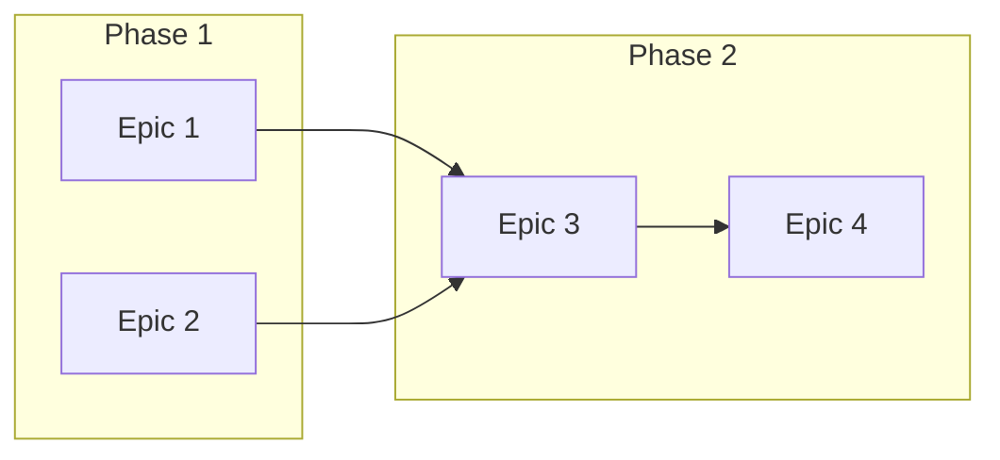

# Roadmap Patterns

> Roadmap 생성 시 사용하는 패턴 및 템플릿

## 기본 Roadmap 템플릿

### 분기별 Roadmap

```markdown
# 🗺️ {year} Q{quarter} Roadmap

**기간**: {start_date} ~ {end_date}
**목표**: {quarter_goal}

## 🎯 분기 목표

1. {goal_1}
2. {goal_2}
3. {goal_3}

## 📅 Epic 타임라인

```mermaid
gantt
    title Q{quarter} Roadmap
    dateFormat YYYY-MM-DD

{epic_sections}
```

## 📊 Epic 상세

{epic_details}

## 🔗 의존성

{dependencies}

## ⚠️ 리스크

{risks}

---
*Generated by SEMO-PM | {generated_at}*
```

---

## Mermaid Gantt 생성

### 기본 구조

```mermaid
gantt
    title {title}
    dateFormat YYYY-MM-DD
    excludes weekends

    section {section_name}
    {task_name} :{task_id}, {start_date}, {duration}d
    {task_name} :{task_id}, after {dependency}, {duration}d
```

### Epic → Gantt 변환

```javascript
function epicToGantt(epics) {
  let gantt = `gantt
    title Project Roadmap
    dateFormat YYYY-MM-DD
    excludes weekends\n`;

  for (const epic of epics) {
    gantt += `\n    section ${epic.title}\n`;

    for (const task of epic.tasks) {
      if (task.dependency) {
        gantt += `    ${task.title} :${task.id}, after ${task.dependency}, ${task.duration}d\n`;
      } else {
        gantt += `    ${task.title} :${task.id}, ${task.startDate}, ${task.duration}d\n`;
      }
    }
  }

  return gantt;
}
```

---

## 의존성 다이어그램

### Epic 간 의존성



### 의존성 분석

```javascript
function analyzeDependencies(epics) {
  const graph = {};
  const criticalPath = [];

  // 의존성 그래프 구축
  for (const epic of epics) {
    graph[epic.id] = {
      dependencies: epic.dependencies || [],
      duration: calculateDuration(epic)
    };
  }

  // Critical Path 계산
  // ... Topological Sort + Longest Path

  return { graph, criticalPath };
}
```

---

## 일정 예측

### Point → 기간 변환

```javascript
function estimateDuration(points, velocity, buffer = 0.2) {
  const baseDays = points / velocity;
  const withBuffer = baseDays * (1 + buffer);
  return Math.ceil(withBuffer);
}

// 예: 30 points, 3pt/day velocity, 20% buffer
// = 30 / 3 * 1.2 = 12 days
```

### 시작일 계산

```javascript
function calculateStartDate(epic, dependencyMap) {
  if (!epic.dependencies.length) {
    return epic.plannedStart || new Date();
  }

  // 모든 의존성 중 가장 늦은 종료일
  let latestEnd = new Date(0);
  for (const depId of epic.dependencies) {
    const dep = dependencyMap[depId];
    const endDate = addDays(dep.startDate, dep.duration);
    if (endDate > latestEnd) {
      latestEnd = endDate;
    }
  }

  return latestEnd;
}
```

---

## 마일스톤 관리

### 마일스톤 생성

```bash
# GitHub Milestone 생성
gh api repos/semicolon-devteam/docs/milestones \
  -X POST \
  -f title="{milestone_title}" \
  -f due_on="{due_date}T23:59:59Z" \
  -f description="{description}"
```

### 마일스톤 상태 조회

```bash
# 마일스톤 목록 조회
gh api repos/semicolon-devteam/docs/milestones \
  --jq '.[] | {title, due_on, open_issues, closed_issues, state}'
```

### 마일스톤 진행률

```javascript
function milestoneProgress(milestone) {
  const total = milestone.open_issues + milestone.closed_issues;
  if (total === 0) return 0;
  return (milestone.closed_issues / total) * 100;
}
```

---

## 리스크 표시

### 리스크 수준

| 수준 | 조건 | 표시 |
|------|------|------|
| 🟢 On Track | 예정대로 진행 | 정상 |
| 🟡 At Risk | 지연 가능성 | 주의 |
| 🔴 Behind | 이미 지연됨 | 위험 |

### 리스크 계산

```javascript
function calculateRisk(epic, today) {
  const expectedProgress = getExpectedProgress(epic, today);
  const actualProgress = getActualProgress(epic);

  const diff = expectedProgress - actualProgress;

  if (diff <= 10) return 'on-track';
  if (diff <= 25) return 'at-risk';
  return 'behind';
}
```

---

## 출력 형식

### Markdown 출력

기본 출력 형식으로, GitHub Issue/Wiki에 직접 사용 가능.

### HTML 출력

```html
<div class="roadmap">
  <h1>Q4 Roadmap</h1>
  <div class="mermaid">
    <!-- Mermaid 차트 -->
  </div>
  <div class="epic-list">
    <!-- Epic 목록 -->
  </div>
</div>
```

### JSON 출력

API 연동이나 대시보드용:

```json
{
  "roadmap": {
    "title": "Q4 Roadmap",
    "startDate": "2024-10-01",
    "endDate": "2024-12-31",
    "epics": [
      {
        "id": "e1",
        "title": "댓글 시스템",
        "status": "in-progress",
        "progress": 60,
        "startDate": "2024-12-01",
        "endDate": "2024-12-14"
      }
    ],
    "milestones": [
      {
        "title": "v2.0 Release",
        "dueDate": "2024-12-31",
        "progress": 45
      }
    ]
  }
}
```
