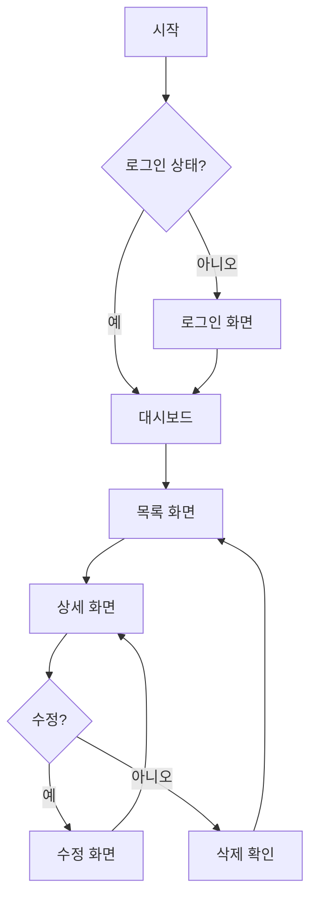
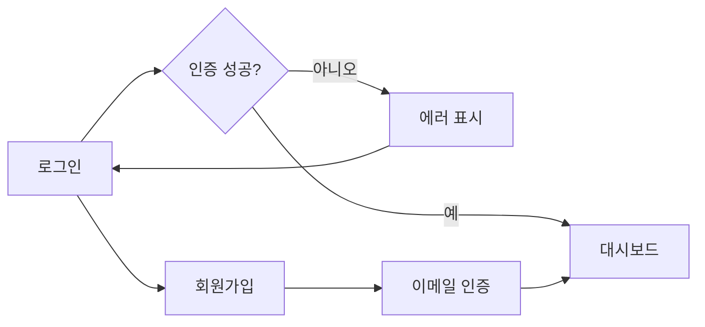
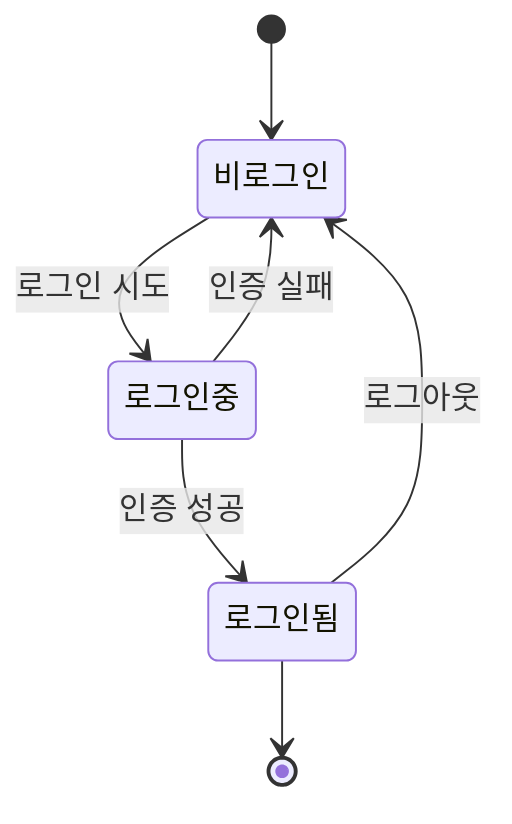

> **시스템 메시지**: 이 Skill이 호출되면 `[SEMO] Skill: design-user-flow 호출` 메시지를 첫 줄에 출력하세요.

# design-user-flow Skill

> 사용자 흐름 다이어그램 및 화면 구조 설계

## Purpose

PRD/Epic을 기반으로 사용자 흐름(User Flow)을 설계하고 화면 구조를 정의합니다.

## Workflow

```
Epic/PRD 분석
    ↓
1. 핵심 사용자 시나리오 식별
2. 화면 목록 정의
3. 화면 간 흐름 설계
4. Mermaid 다이어그램 생성
5. 문서 저장
    ↓
완료
```

## Input

```yaml
epic_url: "https://github.com/.../issues/123"  # Epic Issue URL
# 또는
prd_path: "docs/PRD.md"  # PRD 문서 경로
```

## Output

```markdown
[SEMO] Skill: design-user-flow 완료

✅ 사용자 흐름 설계 완료

**생성된 파일**: docs/design/user-flow.md

### 📊 화면 구조

| 화면 | 설명 | 주요 액션 |
|------|------|----------|
| 로그인 | 사용자 인증 | 로그인, 회원가입 이동 |
| 대시보드 | 메인 화면 | 메뉴 탐색, 알림 확인 |
| 상세 | 상세 정보 | 수정, 삭제, 공유 |
```

## User Flow 문서 템플릿

```markdown
# 사용자 흐름 설계

> Epic: {epic_title}
> 작성일: {date}

## 1. 개요

{project_description}

## 2. 핵심 사용자 시나리오

### 시나리오 1: {scenario_name}

**목표**: {goal}
**사전 조건**: {preconditions}

```
1. 사용자가 {action_1}
2. 시스템이 {response_1}
3. 사용자가 {action_2}
4. ...
```

## 3. 화면 목록

| ID | 화면명 | 경로 | 설명 |
|----|--------|------|------|
| S01 | 로그인 | /login | 사용자 인증 |
| S02 | 대시보드 | /dashboard | 메인 화면 |
| S03 | 목록 | /items | 아이템 목록 |
| S04 | 상세 | /items/:id | 아이템 상세 |
| S05 | 생성 | /items/new | 새 아이템 생성 |

## 4. 사용자 흐름 다이어그램

### 4.1 전체 흐름



### 4.2 인증 흐름



## 5. 화면별 상세

### S01: 로그인 화면

**경로**: `/login`

**구성 요소**:
- 이메일 입력 필드
- 비밀번호 입력 필드
- 로그인 버튼
- 회원가입 링크
- 비밀번호 찾기 링크

**주요 액션**:
| 액션 | 결과 |
|------|------|
| 로그인 성공 | 대시보드로 이동 |
| 로그인 실패 | 에러 메시지 표시 |
| 회원가입 클릭 | 회원가입 화면으로 이동 |

### S02: 대시보드

**경로**: `/dashboard`

**구성 요소**:
- 헤더 (로고, 네비게이션, 프로필)
- 요약 카드 섹션
- 최근 활동 목록
- 퀵 액션 버튼

**주요 액션**:
| 액션 | 결과 |
|------|------|
| 메뉴 클릭 | 해당 화면으로 이동 |
| 알림 클릭 | 알림 상세 표시 |
| 프로필 클릭 | 프로필 드롭다운 |

## 6. 상태 전이 다이어그램



## 7. 다음 단계

- [ ] 목업 생성 (`skill:generate-mockup`)
- [ ] 컴포넌트 설계
- [ ] API 엔드포인트 정의
```

## 완료 메시지

```markdown
[SEMO] Skill: design-user-flow 완료

✅ **사용자 흐름 설계 완료**

| 항목 | 값 |
|------|-----|
| 화면 수 | {screen_count}개 |
| 시나리오 | {scenario_count}개 |
| 문서 경로 | docs/design/user-flow.md |

다음 단계: `skill:generate-mockup` 실행
```

## Related Skills

- `generate-mockup` - UI 목업 생성
- `create-epic` - Epic 생성
- `scaffold-domain` - 도메인 스캐폴딩
