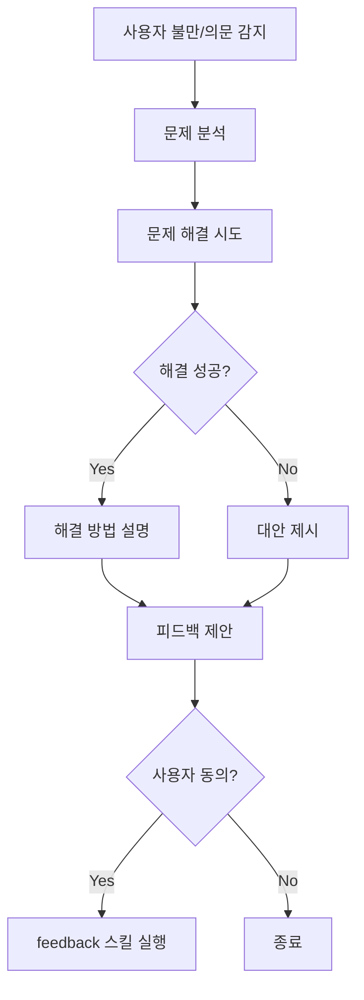

# Trigger Detection

> 피드백 스킬 트리거 감지 패턴

## 명시적 트리거

### 명령어

- `/SAX:feedback`
- `피드백`
- `피드백해줘`
- `이슈 만들어줘`
- `버그 신고`
- `제안할게`

## 암시적 트리거

### 불만/의문 표현 패턴

사용자가 SAX 동작에 대해 의문을 제기하는 패턴:

```
- "이건 이렇게 돼야 하는데 왜 이렇게 만들었어?"
- "왜 이렇게 동작해?"
- "예상한 결과가 아닌데?"
- "의도한 대로 안 되네"
- "이거 잘못된 거 아니야?"
- "원하는 대로 안 됐어"
- "다르게 동작해야 하는데"
- "이상한데?"
- "왜 이래?"
- "이게 맞아?"
```

### 암시적 트리거 처리 프로세스



### 피드백 제안 메시지

```markdown
[SAX] 문제 해결 완료

**원인**: {문제 원인에 대한 설명}

---

⚠️ **{원인}** (으)로 인해 사용자가 의도하지 않은 동작이 발생했습니다.

협업 매니저 Reus를 위해 이 이슈를 피드백할까요?

> "피드백해줘" 또는 "괜찮아"로 응답해주세요.
```

## 트리거 우선순위

1. **명시적 > 암시적**: 명시적 트리거가 항상 우선
2. **문제 해결 우선**: 암시적 트리거 시 문제 해결 먼저 수행
3. **사용자 동의 필수**: 암시적 트리거 시 피드백 생성 전 동의 필요
